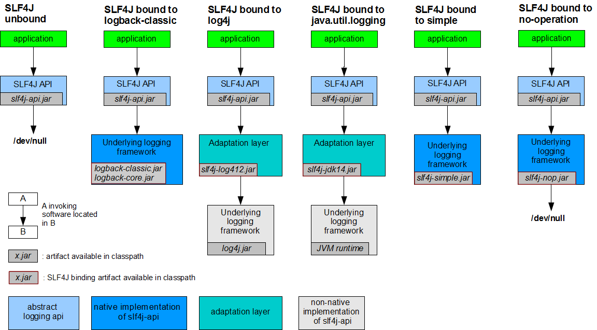

### 1. 底层换实现



### 2.  替换其他日志框架

替换Commonslog

```xml
<!-- https://mvnrepository.com/artifact/org.slf4j/jcl-over-slf4j -->
<dependency>
    <groupId>org.slf4j</groupId>
    <artifactId>jcl-over-slf4j</artifactId>
    <version>1.7.32</version>
</dependency>
```

替换 java-utils.log

```xml
<!-- https://mvnrepository.com/artifact/org.slf4j/jul-to-slf4j -->
<dependency>
    <groupId>org.slf4j</groupId>
    <artifactId>jul-to-slf4j</artifactId>
    <version>1.7.32</version>
</dependency>
```
