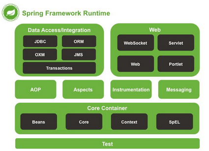

# 一、spring 框架的优点

> - 减轻开发企业级应用的难度
> - 帮助管理模块、管理类
> - 帮助开发人员管理对象，管理对象
> - 轻量 spring 核心功能所需要的jar小，运行时占用的资源少，运行效率高
> - 针对接口编程，解耦合
> - 方便集成其他各种优秀框架

# 二、spring 历史

# 三、spring 全家桶

## 1.spring 架构

> 数据访问模块
>
> web 开发模块
>
> AOP 模块
>
> 核心容器
>
> 集成功能模块
>
> 测试模块

## 2. spring 框架

> - SpringCloud
> - SpringBoot
> - SpringSecurity
> - SpringData
> - SpringMVC
> - 

# 四、spring 核心技术

> ioc(控制反转)
>
> aop(面向切面编程)

