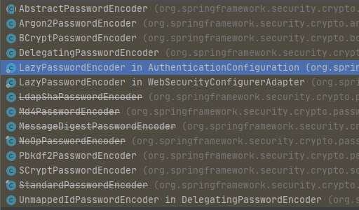

## 一、源码

```java
package org.springframework.security.crypto.password;

/**
 * Service interface for encoding passwords.
 *
 * The preferred implementation is {@code BCryptPasswordEncoder}.
 *
 * @author Keith Donald
 */
public interface PasswordEncoder {

   /**
    * Encode the raw password. Generally, a good encoding algorithm applies a SHA-1 or
    * greater hash combined with an 8-byte or greater randomly generated salt.
    */
   String encode(CharSequence rawPassword);

   /**
    * Verify the encoded password obtained from storage matches the submitted raw
    * password after it too is encoded. Returns true if the passwords match, false if
    * they do not. The stored password itself is never decoded.
    * @param rawPassword the raw password to encode and match
    * @param encodedPassword the encoded password from storage to compare with
    * @return true if the raw password, after encoding, matches the encoded password from
    * storage
    */
   boolean matches(CharSequence rawPassword, String encodedPassword);

   /**
    * Returns true if the encoded password should be encoded again for better security,
    * else false. The default implementation always returns false.
    * @param encodedPassword the encoded password to check
    * @return true if the encoded password should be encoded again for better security,
    * else false.
    */
   default boolean upgradeEncoding(String encodedPassword) {
      return false;
   }

}
```

## 二、具体实现类




