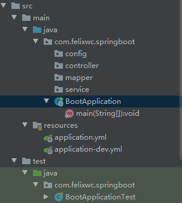
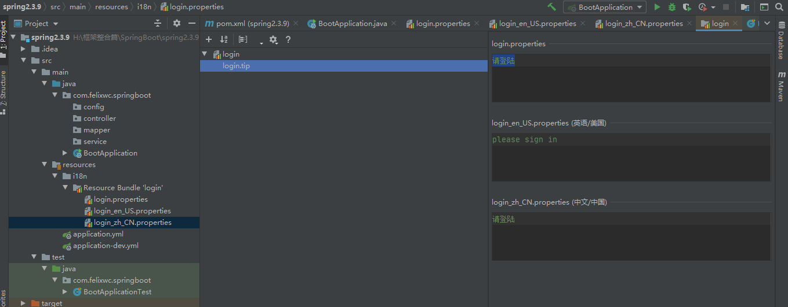
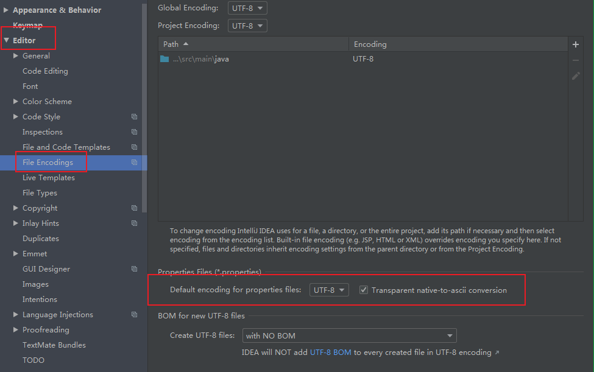
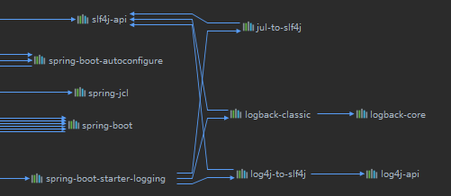
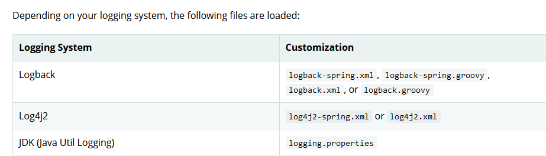
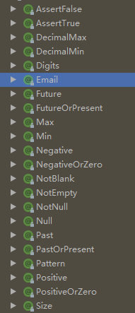

## 1. spring-web

### 1.1 基本环境搭建

> 1. 倒入依赖

```xml
<dependency>
    <groupId>org.springframework.boot</groupId>
    <artifactId>spring-boot-starter-web</artifactId>
</dependency>
<dependency>
    <groupId>org.springframework.boot</groupId>
    <artifactId>spring-boot-starter-test</artifactId>
</dependency>
```

> 2. 编写代码，搭建环境

**目录结构**



**主启动类**

```java
@SpringBootApplication
public class BootApplication {
    public static void main(String[] args) {
        SpringApplication.run(BootApplication.class, args);
    }
}
```

### 1.2 自定义MVC配置

```java
@Configuration
public class MyWebMVCConfig implements WebMvcConfigurer {
    //注册组件
    @Bean
    public LocaleResolver localeResolver() {
        return new MyLocaleResolver();
    }
}
```

**拦截器**

```java
public class MyHandlerInterceptor implements HandlerInterceptor {
    // 返回值代表是否放行
    @Override
    public boolean preHandle(HttpServletRequest request, HttpServletResponse response, Object handler) throws Exception {

        return false;
    }

    @Override
    public void postHandle(HttpServletRequest request, HttpServletResponse response, Object handler, ModelAndView modelAndView) throws Exception {

    }

    @Override
    public void afterCompletion(HttpServletRequest request, HttpServletResponse response, Object handler, Exception ex) throws Exception {

    }
}
```

```java
@Override
public void addInterceptors(InterceptorRegistry registry) {
    registry.addInterceptor(new MyHandlerInterceptor()).addPathPatterns("/**").excludePathPatterns("/index");
}
```

## 2. 国际化

> 1. 编写国际化配置文件

> 

> 2. Spring 自动配置MessageSourceAutoConfiguration

```java
@EnableConfigurationProperties
public class MessageSourceAutoConfiguration {

     @Bean
    @ConfigurationProperties(prefix = "spring.messages")
    public MessageSourceProperties messageSourceProperties() {
        return new MessageSourceProperties();
    }
    @Bean
    public MessageSource messageSource(MessageSourceProperties properties) {
        ResourceBundleMessageSource messageSource = new ResourceBundleMessageSource();
        if (StringUtils.hasText(properties.getBasename())) {
            // 设置国际化文件的基础名（去掉国际语言代码）
            messageSource.setBasenames(StringUtils    .commaDelimitedListToStringArray(StringUtils.trimAllWhitespace(properties.getBasename())));
        }
        if (properties.getEncoding() != null) {
            messageSource.setDefaultEncoding(properties.getEncoding().name());
        }
        messageSource.setFallbackToSystemLocale(properties.isFallbackToSystemLocale());
        Duration cacheDuration = properties.getCacheDuration();
        if (cacheDuration != null) {
            messageSource.setCacheMillis(cacheDuration.toMillis());
        }
        messageSource.setAlwaysUseMessageFormat(properties.isAlwaysUseMessageFormat());
        messageSource.setUseCodeAsDefaultMessage(properties.isUseCodeAsDefaultMessage());
        return messageSource;
    }
 }
```

```java
public class MessageSourceProperties {
    // 默认基础名 classpath: messages.properties 
    private String basename = "messages";
}
```

> 3. 改变默认配置

```yml
spring:
  messages:
    basename: i18n.login,i18n.logout
```

> 4. 页面获取国际化值

```html
# 使用Thymeleaf模板引擎 默认根据浏览器的语言而定
<th th:text="#{msgs.headers.name}">Name</th>
```



> 5. 原理

```java
@Bean
@ConditionalOnMissingBean
@ConditionalOnProperty(prefix = "spring.mvc", name = "locale")
public LocaleResolver localeResolver() {
    // 如果配置则使用默认的
   if (this.mvcProperties.getLocaleResolver() == WebMvcProperties.LocaleResolver.FIXED) {
      return new FixedLocaleResolver(this.mvcProperties.getLocale());
   }
    //默认的区域信息解析器是获取请求头的区域信息
   AcceptHeaderLocaleResolver localeResolver = new AcceptHeaderLocaleResolver();
   localeResolver.setDefaultLocale(this.mvcProperties.getLocale());
   return localeResolver;
}
```

> 6. 自定义区域信息解析器

```java
public class MyLocaleResolver implements LocaleResolver {

    @Override
    public Locale resolveLocale(HttpServletRequest request) {
        String l = request.getParameter("l");
        // 获取系统默认的
        Locale locale= Locale.getDefault();
        if(!StringUtils.isEmpty(l)){
            String[] s = l.split("_");
           locale = new Locale(s[0],s[1]);
        }
        return locale;
    }
    @Override
    public void setLocale(HttpServletRequest request, HttpServletResponse response, Locale locale) {

    }
}
```

```java
@Configuration
public class MyWebMVCConfig implements WebMvcConfigurer {
    @Bean
    public LocaleResolver localeResolver() {
        return new MyLocaleResolver();
    }

}
```

## 3. 日志

### 3.1 SpringBoot依赖关系

```xml
<dependency>
  <groupId>org.springframework.boot</groupId>
  <artifactId>spring-boot-starter</artifactId>
  <version>2.3.9.RELEASE</version>
  <scope>compile</scope>
</dependency>
```

```xml
<dependency>
  <groupId>org.springframework.boot</groupId>
  <artifactId>spring-boot-starter-logging</artifactId>
  <version>2.3.9.RELEASE</version>
  <scope>compile</scope>
</dependency>
```



> 底层采用slf4j-api+logbacke 的方式
> 
> 有中间替换包（包名一样） 

> springboot能自动适配所有的日志，排除其他实现，引入转化包

### 3.2 SpringBoot 的日志配置

> 默认配置：可以在配置文件指定

> 自定义配置



> When possible, we recommend that you use the `-spring` variants for your logging configuration (for example, `logback-spring.xml` rather than `logback.xml`). If you use standard configuration locations, Spring cannot completely control log initialization.

> 这里面还可以使用spring高级特性，详细见官网

## 4. JSR 303校验

> 1. 导入依赖

```xml
<dependency>
    <groupId>javax.validation</groupId>
    <artifactId>validation-api</artifactId>
    <version>2.0.1.Final</version>
</dependency>
```

> 2. 示例

```java
@Validated
public class Person {
    @Email
    private String email;
}
```

> 3. 常用注解



## 5. 整合jdbc

> 1. 导入依赖

```java
<dependency>
    <groupId>org.springframework.boot</groupId>
    <artifactId>spring-boot-starter-jdbc</artifactId>
</dependency>
```

> 2. 在配置文件中配置数据源

```yml
spring:
  datasource:
    driver-class-name: com.mysql.cj.jdbc.Driver
    url: jdbc:mysql://localhost:3306/password_system?useUnicode=true&characterEncoding=UTF-8&serverTimezone=GMT%2B8
    username: pwmanager
    password: Wc@0413.com
```

> 3. 使用

```java
@Autowired
JdbcTemplate jdbcTemplate;
public String getUser(){
    String sql = "";
    List<Map<String, Object>> maps = jdbcTemplate.queryForList(sql);
    return maps.toString();
}
```

## 6. 整合Druid数据源（未完成）

### 6.1 基本整合

> 1. 导包

```xml
<dependency>
    <groupId>com.alibaba</groupId>
    <artifactId>druid</artifactId>
    <version>1.2.4</version>
</dependency>
```

> 2. 配置

```yml
datasource:
  driver-class-name: com.mysql.cj.jdbc.Driver
  url: jdbc:mysql://localhost:3306/password_system?useUnicode=true&characterEncoding=UTF-8&serverTimezone=GMT%2B8
  username: xxxx
  password: xxxx
  type: com.alibaba.druid.pool.DruidDataSource
```

## 7. 整合Mybatis

> 1. 导入依赖

```xml

```

## 8. 整合Mybatis-plus

## 9. 整合Thymeleaf

## 10. 整合shiro

## 11. 整合Redis

## 12. 整合RabbitMQ

## 13. 整合ElasticSearch

## 14. 整合SpringSecurity

## 15. 整合Quartz

## 16. 异步任务

> 1. 开启异步注解功能@EnalbeAsync
> 2. 在方法上标注注解@Async 

## 17. 邮件任务

> 1. 导入依赖

```
<dependency>
    <groupId>org.springframework.boot</groupId>
    <artifactId>spring-boot-starter-mail</artifactId>
</dependency>
```

> 2. 配置

```mail
mail:
  username:
  password:
  host:
```

> 3. 编码
>    
>    使用xxxmailsender 模板进行编码即可

## 18. 定时任务

> 1. 开启功能 @EnalbeScheduling
> 2. 表示什么时候执行@Scheduled(标在方法上)

```java
@Scheduled(corn="")
public void Scheduledtask(){

}
```
