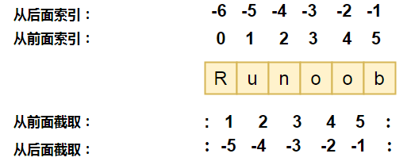
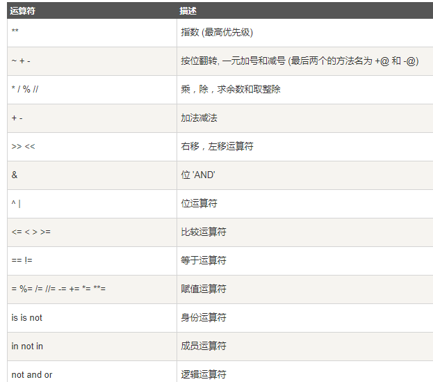

# 一、Python 标识符

> - 标识符由字母、数字和下划线组成，但是不能以数字开头
> - 区分大小写
> - 以下划线开头的标识符有特殊意义
>   - 

# 二、Python 保留字符

> 保留字即关键字，我们不能把它们用作任何标识符名称。Python 的标准库提供了一个 keyword 模块，可以输出当前版本的所有关键字：

```python
>>> import keyword
>>> keyword.kwlist
['False', 'None', 'True', 'and', 'as', 'assert', 'break', 'class', 'continue', 'def', 'del', 'elif', 'else', 'except', 'finally', 'for', 'from', 'global', 'if', 'import', 'in', 'is', 'lambda', 'nonlocal', 'not', 'or', 'pass', 'raise', 'return', 'try', 'while', 'with', 'yield']
```

# 三、注释

```python
# 第一个注释
# 第二个注释
 
'''
第三注释
第四注释
'''
 
"""
第五注释
第六注释
"""
```

# 四、简单语句

## 4.1 缩进

> - 相当于大括号
> - 一定要保持一个语句块的缩进一致

```python
if True:
    print ("True")
else:
    print ("False")
```

## 4.2 多行语句

Python 通常是一行写完一条语句，但如果语句很长，我们可以使用反斜杠(\)来实现多行语句，例如：

```
total = item_one + \
        item_two + \
        item_three
```

在 [], {}, 或 () 中的多行语句，不需要使用反斜杠(\)，例如：

```python
total = ['item_one', 'item_two', 'item_three',
        'item_four', 'item_five']
```

## 4.3 空行

> 函数之间或类的方法之间用空行分隔，表示一段新的代码的开始。类和函数入口之间也用一行空行分隔，以突出函数入口的开始。
>
> 空行与代码缩进不同，空行并不是Python语法的一部分。书写时不插入空行，Python解释器运行也不会出错。但是空行的作用在于分隔两段不同功能或含义的代码，便于日后代码的维护或重构。

## 4.4 一行多条语句

```python
import sys; x = 'runoob'; sys.stdout.write(x + '\n')
```

## 4.5 简单的导入导出语句

> 在 python 用 **import** 或者 **from...import** 来导入相应的模块。
>
> 将整个模块(somemodule)导入，格式为： **import somemodule**
>
> 从某个模块中导入某个函数,格式为： **from somemodule import somefunction**
>
> 从某个模块中导入多个函数,格式为： **from somemodule import firstfunc, secondfunc, thirdfunc**
>
> 将某个模块中的全部函数导入，格式为： **from somemodule import \***

## 4.6 简单的输入输出语句

```python
input("\n\n按下 enter 键后退出。")
print( x )
```

# 五、变量

## 5.1 变量声明语句

```python
a = b = c = 1
a, b, c = 1, 2, "runoob"
del var1[,var2[,var3[....,varN]]]

```

## 5.2 基本变量类型

### 5.2.1 数字

**int、float、bool、complex（复数）**

```python
a, b, c, d = 20, 5.5, True, 4+3j
print(type(a), type(b), type(c), type(d))
<class 'int'> <class 'float'> <class 'bool'> <class 'complex'>
```


### 5.2.2 字符串

> Python中的字符串用单引号 **'** 或双引号 **"** 括起来，同时使用反斜杠 **\** 转义特殊字符。
>
> 字符串的截取的语法格式如下：
>
> 变量[头下标:尾下标]



```python
#!/usr/bin/python3

str = 'Runoob'

print (str)          # 输出字符串
print (str[0:-1])    # 输出第一个到倒数第二个的所有字符
print (str[0])       # 输出字符串第一个字符
print (str[2:5])     # 输出从第三个开始到第五个的字符
print (str[2:])      # 输出从第三个开始的后的所有字符
print (str * 2)      # 输出字符串两次，也可以写成 print (2 * str)
print (str + "TEST") # 连接字符串
```

### 5.2.3 列表

### 5.2.4 元组

### 5.2.5 集合

### 5.2.6 字典

# 六、流程控制语句

## 6.1 分支结构

```python
if 表达式1:
    语句
    if 表达式2:
        语句
    elif 表达式3:
        语句
    else:
        语句
elif 表达式4:
    语句
else:
    语句
```

## 6.2 循环结构

> else 字句可以省略

```
while <expr>:
    <statement(s)>
else:
    <additional_statement(s)>
```

```
for <variable> in <sequence>:
    <statements>
else:
    <statements>
```

## 6.3 特殊语句

```python
break
continue
pass # 表示啥也不做
```

# 七、运算符

## 7.1 算术运算符

> +
>
> -
>
> *
>
> /   除
>
> % 求余
>
> //  取余
>
> ** 乘方

```python
a = 21
b = 10
c = 0
 
c = a + b
print ("1 - c 的值为：", c)
 
c = a - b
print ("2 - c 的值为：", c)
 
c = a * b
print ("3 - c 的值为：", c)
 
c = a / b
print ("4 - c 的值为：", c)
 
c = a % b
print ("5 - c 的值为：", c)
 
# 修改变量 a 、b 、c
a = 2
b = 3
c = a**b 
print ("6 - c 的值为：", c)
 
a = 10
b = 5
c = a//b 
print ("7 - c 的值为：", c)
```

## 7.2 比较（关系）运算符

```
< > <= >= == !=
```

## 7.3 赋值运算符

```
= += -= *= /= **= %= //=
```


## 7.4 位运算符

```
a = 0011 1100

b = 0000 1101

-----------------

a&b = 0000 1100

a|b = 0011 1101

a^b = 0011 0001

~a  = 1100 0011
a << 2  = 1111 0000
a >>2 = 0000 1111
```


## 7.5 逻辑运算符

```
and or not
```

## 7.6 成员运算符

```
 in 
 not in
```

## 7.7 身份运算符

```
is
not is
```

## 7.8 运算符优先级



# 八、函数

# 九、迭代器与生成器

## 9.1 迭代器

```python
#!/usr/bin/python3
 
import sys         # 引入 sys 模块
 
list=[1,2,3,4]
it = iter(list)    # 创建迭代器对象
 
while True:
    try:
        print (next(it)) # 循环打印 1\n 2\n 3\n 4\n
    except StopIteration:
        sys.exit()
```

## 9.2 生成器

```python
import sys
 
def fibonacci(n): # 生成器函数 - 斐波那契
    a, b, counter = 0, 1, 0
    while True:
        if (counter > n): 
            return
        yield a # 重点
        a, b = b, a + b
        counter += 1
f = fibonacci(10) # f 是一个迭代器，由生成器返回生成
 
while True:
    try:
        print (next(f), end=" ")
    except StopIteration:
        sys.exit()
        
# 结果 ： 1 1 2 3 5 8 13 21 34 55
```

