# 一、引言

## 1. 数据库系统的发展经历了三代演变

### 1.1 层次/网状数据库系统

### 1.2 关系数据库系统

### 1.3 新一代数据库系统

## 2. 造就了四位图灵奖得主

> C.W.Bachman、E.F.Codd、James Gray、 M.R.Stonebraker 

### 2.1 C.W.Bachman

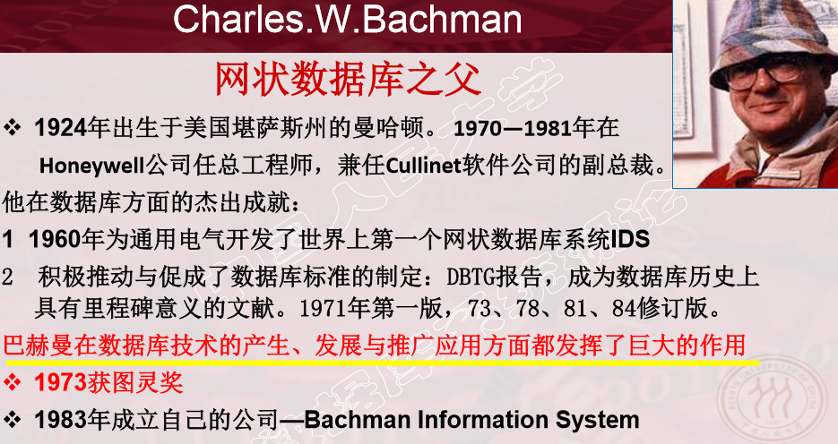

### 2.2 E.F.Codd

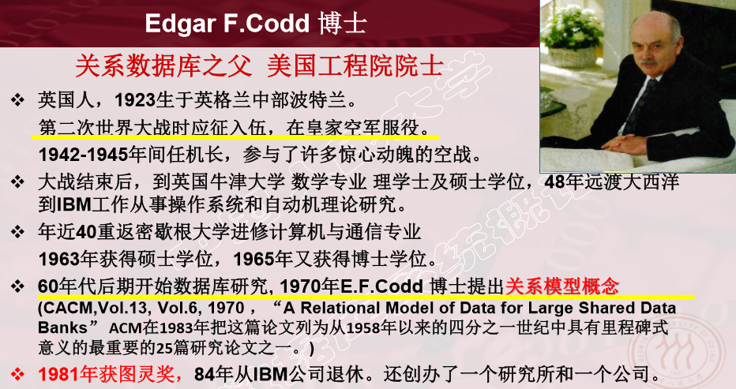

### 2.3 James Gray

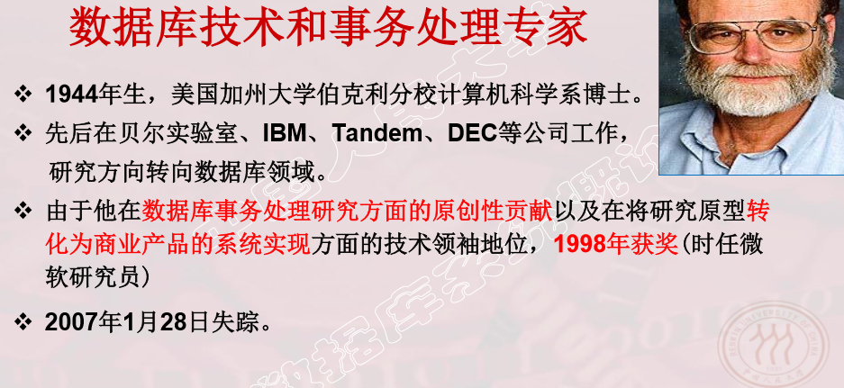

### 2.4 M.R.Stonebraker

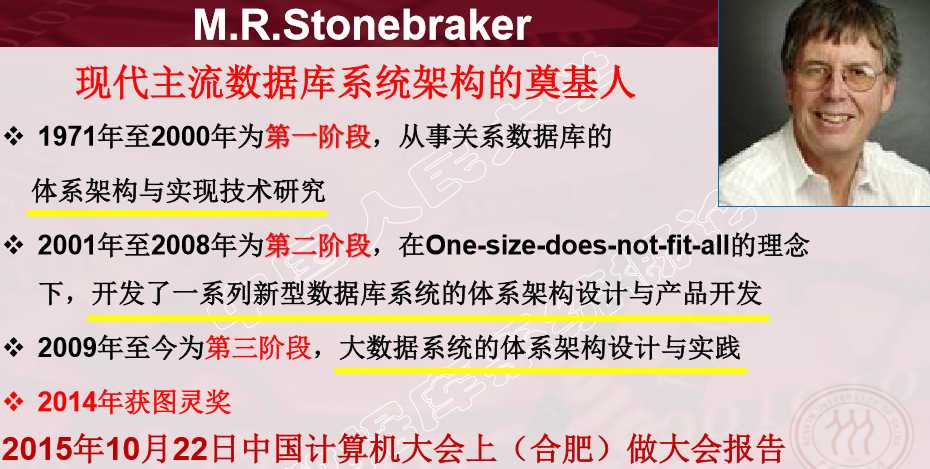

## 3. 发展了一门计算机基础学科

> 数据建模和DBMS核心技术为主，内容丰富领域宽广

## 4. 带动了一个巨大的软件产业

> DBMS及其相关工具产品、应用套件、解决方案 

# 二、数据库系统概述

# 1. 数据库的四个基本概念

### 1.1  数据（Data）

> - 数据（Data）是数据库中存储的基本对象
> - 数据的定义 : 描述事物的符号记录 
> - 数据的种类 : 数字、文字、图形、图像、音频、视频、学生的档     案记录、订单情况等等 
> - 数据的语义：数据的含义，数据与其语义不可分割
> - 数据是有结构的，数据的形式不能完全表示其内容

### 1.2  数据库（Database,DB)

> - 数据库： 是长期储存在计算机内、有组织的、可共享的大量数据的集合
>
> - 为什么要建立数据库：收集并抽取出一个应用所需要的大量数据，将其保存，以供进一步加工处理， 抽取有用信息，转换为有价值的知识。 
>
> - 数据库的基本特征：
>   - 数据按一定的数据模型组织、描述和储存 
>   - 可为各种用户共享、冗余度较小、易扩展 
>   - 数据独立性较高 

### 1.3  数据库管理系统（DataBase Management System, DBMS)

> - 数据库管理系统：位于用户应用与操作系统之间的一层数据管理软件 ，是基础软件，是一个大型复杂的软件系统  
> - 数据库管理系统的用途： 科学地组织和存储数据、高效地获取和维护数据 

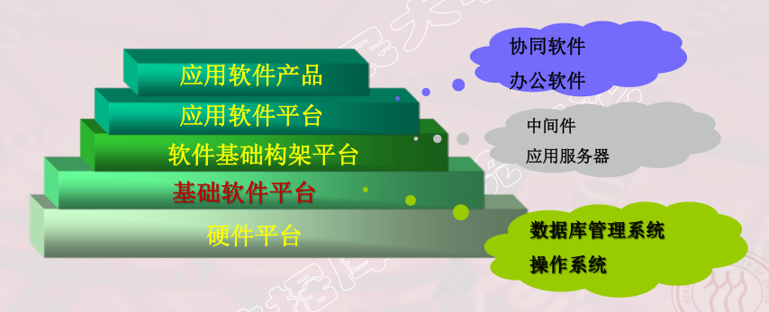

#### 1.3.1 主要功能

> 1. 数据的定义功能
>
>    - 提供数据定义语言（DDL） 
>    - 定义数据库中的数据对象 
>
> 2. 数据组织、存储和管理
>
>    - 分类组织、存储和管理各种数据 
>    - 确定数据在存储级别上的结构和存取方式 
>    -  实现数据之间的联系 
>    -  提供多种存取方法提高存取效率 
>
> 3. 数据操纵功能
>
>    - 提供数据操纵语言（DML） 
>    - 实现对数据库的基本操作  （查询、插入、删除和修改） 
>
> 4. 数据库的事务管理和运行管理
>
>    -  数据的安全性、完整性、多用户对数据的并发使用 
>    -  发生故障后的系统恢复数据库 
>
> 5. 数据库的建立和维护功能
>
>    - 提供实用程序/工具，完成数据库数据批量装载，数据库转储，介质故障恢复，数据库的重组织和性能监视等
>
> 6. 其他功能
>
>    - 数据库管理系统与网络中其它软件系统的通信
>    - 数据库管理系统系统之间的数据转换 
>    - 异构数据库之间的互访和互操作  
>
>    

### 1.4  数据库系统（DataBase System,DBS）

> - 数据库系统（Database System，简称DBS） 
>   - 是指在计算机系统中引入数据库后的系统构成。
>   - 在不引起混淆的情况下常常把数据库系统简称为数据库。 
> -  数据库系统的构成 
>   - 数据库 
>   - 数据库管理系统（及其应用开发工具） 
>   - 应用程序 
>   - 数据库管理员（DataBase Administrator，DBA）   

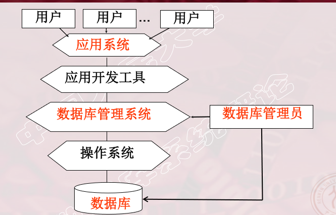

## 2. 数据管理技术的产生和发展

### 2.1 数据管理

> - 对数据进行分类、组织、编码、存储、检索和维护  
> - 数据处理和数据分析的中心问题 

### 2.2 数据管理技术的发展过程

> -  人工管理阶段（20世纪50年代中之前）
> - 文件系统阶段（20世纪50年代末--60年代中） 
> - 数据库系统阶段（20世纪60年代末--现在）  

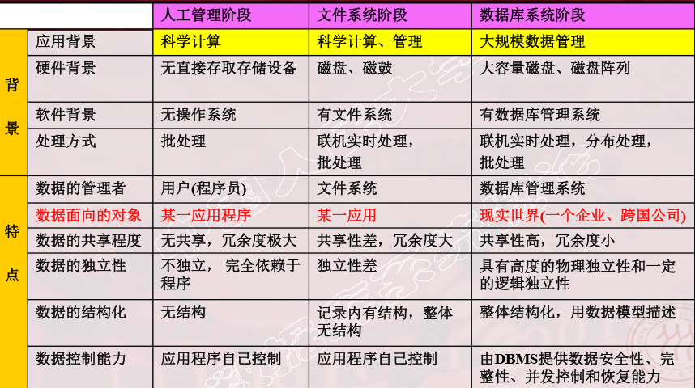

**人工管理阶段**

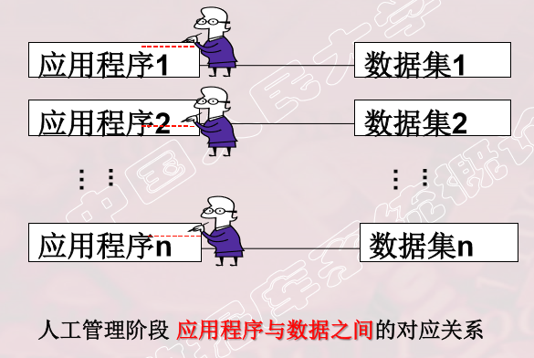

**文件系统阶段**

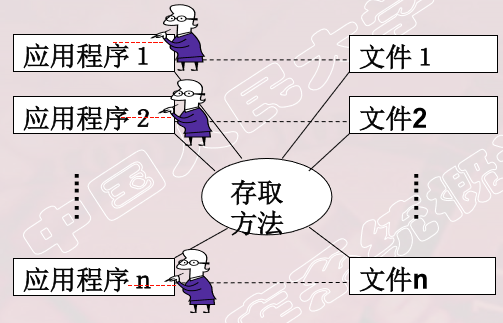

**数据库系统阶段**

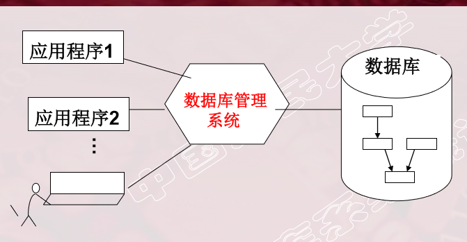

## 3. 数据系统的特点

### 3.1 数据结构化

> - 数据的整体结构化是数据库的主要特征之一     
>   - 不再仅仅针对某一个应用，而是面向整个企业或组织 
>   - 不仅数据内部结构化，整体是结构化的，数据之间具有联系
>   - 数据记录可以变长
>   - 数据的最小存取单位是数据项 
> - 数据用数据模型描述，无需应用程序定义 

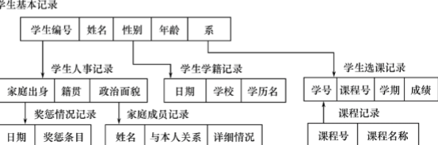

### 3.2 数据的共享性高，冗余度低且易扩充

> - 数据面向整个系统，可以被多个用户、多个应用共享使用。
>
> -  数据共享的好处 
>   - 减少数据冗余，节约存储空间 
>   - 避免数据之间的不相容性与不一致性
>   - 使系统易于扩充 

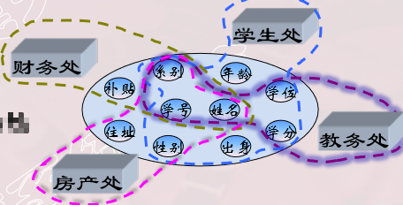

### 3.3 数据独立性高

> - 物理独立性 
>   - 指用户的应用程序与数据库中数据的物理存储是相互独立的。
>   - 当数据的物理存储改变了，应用程序不用改变。 
> -  逻辑独立性 
>   - 指用户的应用程序与数据库的逻辑结构是相互独立的。
>   - 数据的逻辑 结构改变了，应用程序不用改变。 
> - 数据独立性由数据库管理系统的二级映像功能来保证。 

### 3.4 数据由数据库管理系统统一管理和控制

# 三、数据模型

> - 数据模型是对现实世界数据特征的抽象。 
> - 通俗地讲数据模型就是现实世界的模拟。 
> - 数据模型应满足三方面要求： 
>   - 能比较真实地模拟现实世界； 
>   - 容易为人所理解； 
>   - 便于在计算机上实现；  
> - 数据模型是数据库系统的核心和基础 

## 1. 两类数据模型

### 1.1 概念模型（信息模型）

> 按用户的观点来对数据和信息建模，用于数据库设计。 

### 1.2 逻辑模型和物理模型

> - 逻辑模型主要包括网状模型、层次模型、关系模型、面向对象数据模型、对 象关系数据模型、半结构化数据模型等。 按计算机系统的观点对数据建模，用于DBMS实现。 
> -  物理模型是对数据最底层的抽象     
>   - 描述数据在系统内（磁盘上）的表示方式和存取方法。

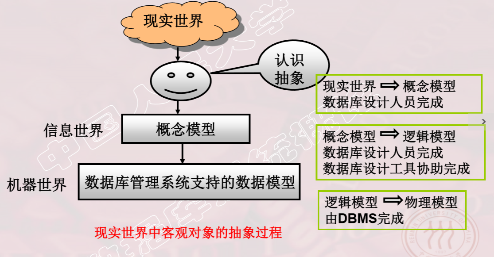

## 2. 概念模型

> - 概念模型的用途 
>   - 概念模型用于信息世界的建模 
>   - 是现实世界到机器世界的一个中间层次 
>   - 是数据库设计的有力工具 
>   - 数据库设计人员和用户之间进行交流的语言 
> - 对概念模型的基本要求 
>   - 较强的语义表达能力 
>   - 简单、清晰、易于用户理解 

### 2.1 信息世界中的基本概念

> - 实体（Entity）  客观存在并可相互区别的事物称为实体。 可以是具体的人、事、物或抽象的概念。 
> - 属性（Attribute）  实体所具有的某一特性称为属性。一个实体可以由若干个属性来刻画。   （3）
> - 码（Key）  唯一标识实体的属性集称为码。
> - 实体型（Entity Type）  用实体名及其属性名集合来抽象和刻画同类实体称为实体型 
> - 实体集（Entity Set）  同一类型实体的集合称为实体集  
> - 联系（Relationship）    
>   - 现实世界中事物内部以及事物之间的联系在信息世界中反映为实体（型）内部的联系和实体（型）之间的联系。 
>     -  实体内部的联系: 是指组成实体的各属性之间的联系
>     - 实体之间的联系: 通常是指不同实体集之间的联系 实体之间的联系有一对一（1:1）、一对多（1:n）和多对多（m:n）等多种类型 

### 2.2 概念模型的表示方法

> 实体-联系方法（Entity-Relationship Approach） 
>
> - 用E-R图来描述现实世界的概念模型 
> - E-R方法也称为E-R模型 

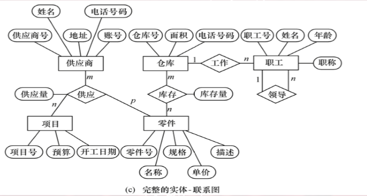

## 3. 数据模型的组成要素

> - 数据模型是严格定义的一组概念的集合      	
>   - 精确地描述了系统的静态特性、动态特性和完整性约束条件 (Integrity Constraints)。 
> -  数据模型由三部分组成 
>   - 数据结构--描述系统的静态特性
>   - 数据操作--描述系统的动态特性
>   - 完整性约束 

### 3.1 数据结构

> - 刻画数据模型性质的重要方面 
>   - 数据结构的类型来命名数据模型 
>     - 层次结构-层次模型、网状结构--网状模型、关系结构—关系模型 
> -  描述数据库的组成对象--对象的类型、内容、性质 
> - 描述对象之间的联系 

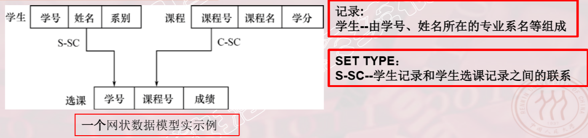

### 3.2 数据操纵

> -  数据操作 
>   - 对数据库中各种对象的实例允许执行的操作的集合     
>   - 包括操作及有关的操作规则 
> -  数据操作的类型 
>   - 查询 
>   -  更新（包括插入、删除、修改） 
> - 数据操作语言 
>   -  定义数据操作的确切含义、符号、优先级别 
>   -  实现数据操作的语言 
>     -  查询语言——Query Language 
>     -  更新语言——Insert、Delete、Update

### 3.3 数据完整性约束条件

> - 一组完整性规则的集合 
>   - 完整性规则：给定的数据模型中数据及其联系所具有的制约和依 存规则。
>   - 用以限定符合数据模型的数据库状态以及状态的变化，以保证数 据的正确、有效和相容。
> - 数据模型对完整性约束条件的定义 
>   - 反映和规定必须遵守的基本的通用的完整性约束条件。 
>   - 提供定义完整性约束条件的机制，以反映具体应用所涉及的数据 必须遵守的特定的语义约束条件。  

## 

## 4. 常用的数据模型

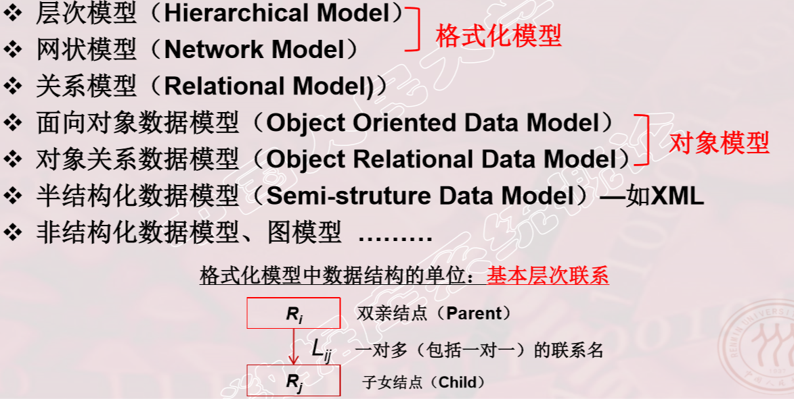

## 5. 层次模型

> -  层次模型用树形结构来表示各类实体以及实体间的联系
> - 表示方法 
>   - 实体型：用记录类型描述每个结点表示一个记录类型（实体） 
>   - 属性：用字段描述每个记录类型可包含若干个字段 
>   - 联系：用结点之间的连线表示记录类型（实体）之间的一对多的父子联系 
> - 层次模型的定义  
>   - 满足下面两个条件的基本层次联系的集合为层次模型 
>     - 有且只有一个结点没有双亲结点，这个结点称为根结点
>     -  根以外的其它结点有且只有一个双亲结点   
> - 层次模型的数据操纵 
>   - 查询 
>   - 插入  
>   - 删除  
>   - 更新  
> - 层次模型的完整性约束条件  
>   - 无相应的双亲结点值就不能插入子女结点值 
>   - 如果删除双亲结点值，则相应的子女结点值也被同时删除 
>   - 更新操作时，应更新所有相应记录，以保证数据的一致性  
> - 优点
>   -  层次模型的数据结构比较简单清晰  
>   - 查询效率高，性能优于关系模型，不低于网状模型 
>   - 层次数据模型提供了良好的完整性支持 
> -  缺点  
>   - 结点之间的多对多联系表示不自然 
>   - 对插入和删除操作的限制多，应用程序的编写比较复杂  
>   - 查询子女结点必须通过双亲结点 
>   - 层次数据库的命令（语言）趋于程序化  

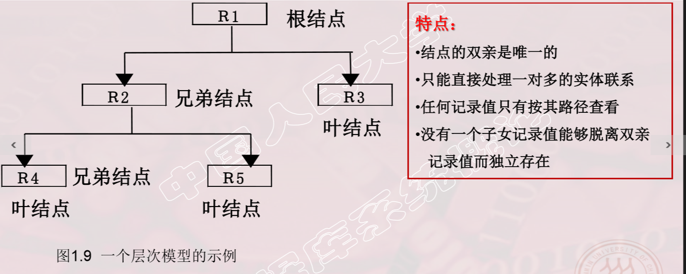

## 6. 网状模型

> - 网状数据库系统采用网状结构来表示各类实体以及实体间的联系  
> - 表示方法（与层次数据模型相同） 
>   - 实体型：用记录类型描述每个结点表示一个记录类型（实体） 
>   - 属性：用字段描述每个记录类型可包含若干个字段 
>   - 联系：用结点之间的连线表示记录类型（实体）之间的一对多的父子联系
> - 网状模型的定义 
>   - 满足下面两个条件的基本层次联系的集合： 
>     - 允许一个以上的结点无双亲； 
>     - 一个结点可以有多于一个的双亲。  
> - 导航式的查询语言和增删改操作语言
> - 完整性约束条件不严格
>   - 允许插入尚未确定双亲结点值的子女结点值
>   - 允许只删除双亲结点值 
>   - 实际的网状数据库系统提供了一定的完整性约束 
>     - 支持码的概念：唯一标识记录的数据项的集合，取唯一的值；   
>     - 保证一个联系中双亲记录与子女记录之间是一对多联系；  
>     - 可以定义双亲记录和子女记录之间某些约束条件。 
>       - 例：“属籍类别”的概念 
>         - 要求双亲记录存在才能插入子女记录，双亲记录删除时也连同删除。
>         - 选课记录就应该满足这种约束条件： 学生选课记录值中学号必须是学生记录中存在的某一学生的学号， 课程号必须是课程记录中存在的某一门课程号。 
>         - 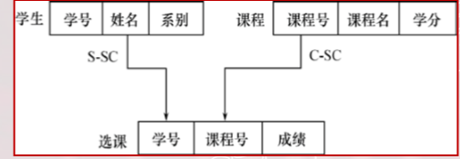
> -  优点  
>   - 能够更为直接地描述现实世界，如一个结点可以有多个双亲； 
>   - 具有良好的性能，存取效率较高。
> - 缺点
>   - 结构比较复杂，而且随着应用环境的扩大，数据库的结构就变得越来越 复杂，不利于最终用户掌握； 
>   - DDL、DML语言复杂，用户不容易使用；
>   - 记录之间联系是通过存取路径实现的，应用程序必须选择存取路径， 加重了程序员的负担。  

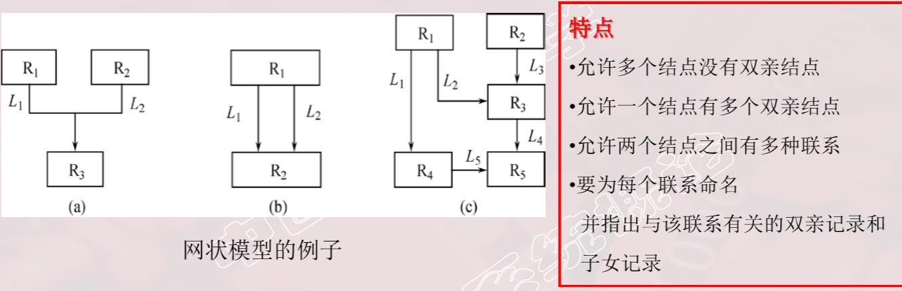

> **多对多联系在网状模型中的表示**

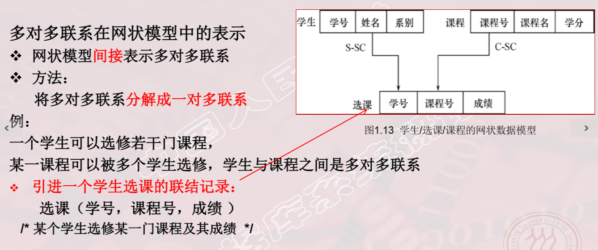

## 7. 关系模型

> -  关系数据库系统采用关系模型作为数据的组织方式
>
> - 1970年美国IBM公司San Jose研究室的研究员E.F.Codd首 次提出了数据库系统的关系模型  
>
> - 计算机厂商推出的数据库管理系统几乎都支持关系模型 
>
> - 在用户观点下，关系模型中数据的逻辑结构是一张二维表。
>
>   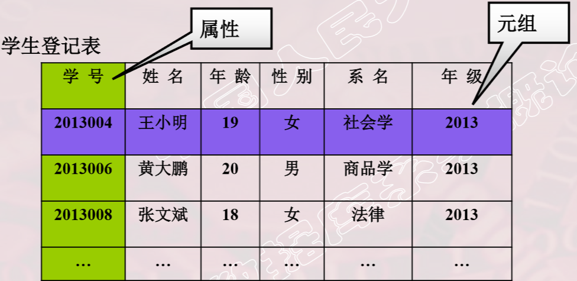

> - 数据结构
>   -  关系（Relation）—— 一个关系对应通常说的一张表 
>   - 元组（Tuple）—— 表中的一行即为一个元组 
>   - 属性（Attribute）——表中的一列即为一个属性，给每一个属性起一个名称即属性名 
>   - 主码（Key）——也称码键。表中的某个属性组，它可以唯一确定一个元组  
>   - 域（Domain）——是一组具有相同数据类型的值的集合。                                      
>     - 属性的取值范围来自某个域。       
>     - 例：学生年龄属性的域（15～45岁），性别的域是（男，女），系名的域是一个学校所有系名的集合； 
>   - 分量——元组中的一个属性值。 
>   - 关系模式——对关系的描述 
>     - 关系名（属性1，属性2，…，属性n） 
>     - 例：学生（学号，姓名，年龄，性别，系名，年级） 
> - 关系的规范化：满足一定的条件
>   - 关系的每一个分量必须是一个不可分的数据项
> - 数据操作是集合操作，操作对象和操作结果都是关系
>   - 查询 插入 删除 更新 
>   -  存取路径对用户隐蔽，用户只要指出“找什么”，不必详 细说明“怎么找”。 提高了数据的独立性，提高了用户生产率
> - 关系的完整性约束条件  (前两个为关系的两个不变性 )
>   - 实体完整性 
>   - 参照完整性 
>   - 用户定义的完整性 
> - 优点 
>   - 建立在严格的数学概念的基础上 
>   - 概念单一
>   -  实体和各类联系都用关系来表示 
>   - 对数据的检索结果也是关系  关系模型的存取路径对用户透明 
>   -  具有更高的数据独立性，更好的安全保密性 
>   - 简化了程序员的工作和数据库开发建立的工作 
> - 缺点 
>   - 存取路径对用户透明，查询效率往往不如格式化数据模型 
>   - 为提高性能，必须对用户的查询请求进行优化，增加了开发数据库管理系统 的难度  

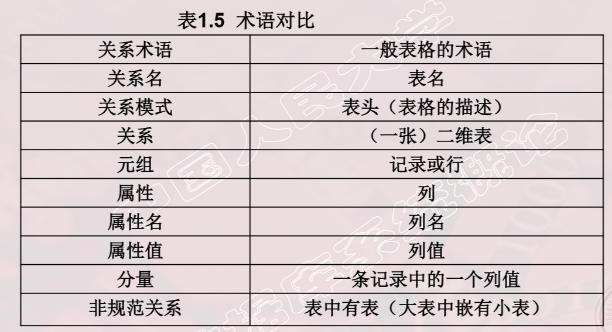

# 四、数据库系统的结构

> - 从数据库应用开发人员角度看     
>   - 数据库系统采用三级模式结构，是数据库系统内部的系统结构  
> - 从数据库最终用户角度看,数据库系统的结构有： 
>   - 单用户结构 
>   - 主从式结构 
>   - 分布式结构 
>   - 客户-服务器 
>   - 浏览器-应用服务器／数据库服务器  
>   - 等 

## 1. 数据库系统模式的概念

> - 模式（Schema） 
>   - 是对数据库逻辑结构和特征的描述 
>   - 是型的描述，不涉及具体值 
>   - 模式是相对稳定的 
> - 实例（Instance） 
>   - 数据库某一时刻的状态——模式的一个具体值 
>   - 同一个模式可以有很多实例 
>   - 实例随数据库中的数据的更新而变动 

## 2. 数据库系统的三级模式结构

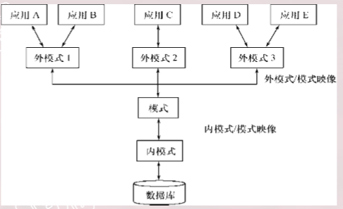

### 2.1 模式（也称逻辑模式）

> - 数据库中全体数据的逻辑结构和特征的描述 
> - 所有用户的公共数据视图 
> -  一般，某个应用的数据库有一个模式 
> - 模式是数据库系统模式结构的中心  
>   - 与数据的物理存储细节和硬件环境无关 
>   - 与具体的应用程序、开发工具及高级程序设计语言无关
> - 定义模式  
>   - DDL定义数据的逻辑结构，以某种数据模型为基础数据记录由哪些数据项构成，数据项的名字、类型、取值范围等 
>   - 定义数据之间的联系  
>   - 定义与数据有关的安全性、完整性要求 

### 2.2 外模式（也称子模式或用户模式）

> - 数据库用户使用的局部数据的逻辑结构和特征的描述 
> - 数据库用户的数据视图，是与某一应用有关的数据的逻辑表示 
> - 外模式与模式的关系 
>   - 外模式通常是模式的子集、一个模式可以有多个外模式 ,反映了不同的用户的应用需求、看待数据的方式、对数据保密的要求 
>   - 对模式中某一数据，在不同的外模式中 结构、类型、长度、保密级别等都可以不同  
> - 外模式与应用的关系 
>   - 一个外模式可以为 多个应用系统所使用，一个应用程序只能使用一个外模式 
> -  外模式的用途 
>   - 每个用户只能看见和访问所对应的外模式中的数据，简化用户视图 
>   - 保证数据库安全性的一个有力措施  

### 2.3 内模式

> - 是数据物理结构和存储方式的描述 
> -  是数据在数据库内部的表示方式 
>   - 记录的存储方式 （例如，顺序存储，堆存储，Cluster按hash方法存储等） 
>   -  索引的组织方式（B+树，Bitmap，Hash）  
>   - 数据是否压缩存储 
>   -  数据是否加密 
>   - 数据存储记录结构的规定—如定长/变长，记录是否可以跨页存放等 
> -  一个数据库只有一个内模式 

## 3. 数据库的二级映像功能与数据独立性

> - 三级模式是对数据的三个抽象级别 
> - 数据库管理系统内部提供二级映像 
>   - 外模式／模式映像 
>   - 模式／内模式映像  
> - 三个抽象层次的联系和转换 

### 3.1 外模式／模式映像

> - 对每一个外模式，有一个外模式／模式映像 定义外模式与模式之间的对应关系
>   -  映像定义通常包含在各外模式的描述中 
> - 保证数据的逻辑独立性 
>   - 当模式改变时，数据库管理员对外模式／模式      映像作相应改变，使外模式保持不变 
>   - 应用程序是依据数据的外模式编写的，应用程序不必修改，保证了数据 与程序的逻辑独立性，简称数据的逻辑独立

### 3.2 模式／内模式映像

> - 定义了数据全局逻辑结构与存储结构之间的对应关系。如，说明某个逻辑记录对应何种存储结构。  
> - 数据库中模式／内模式映象是唯一的。 该映象定义通常包含在模式描述中。  
> - 保证数据的物理独立性 
>   -  当数据库的存储结构改变了（例如选用了另一种存储结构），数据库管理员 修改模式／内模式映象，使模式保持不变。
>   - 模式不变，则应用程序不变。保证了数据与程序的物理独立性，简称数据的物理独立性

> 总结：
>
> - 保证了应用程序的稳定性       
>   - 除非应用需求本身发生变化，否则应用程序一般不需要修改。 
> - 从程序为中心——发展为 以数据为中心     
>   -  具有了数据与程序之间的独立性，使得数据的定义和描述可以从应用 程序中分离出去 。 
> - 数据的存取由数据库管理系统管理 
>   - 简化了应用程序的编制 
>   - 大大减少了应用程序的维护和修改 

# 五、数据库系统的组成

> - 数据库 
> - 数据库管理系统（及其开发工具） 
> - 应用程序 
> - 数据库管理员 

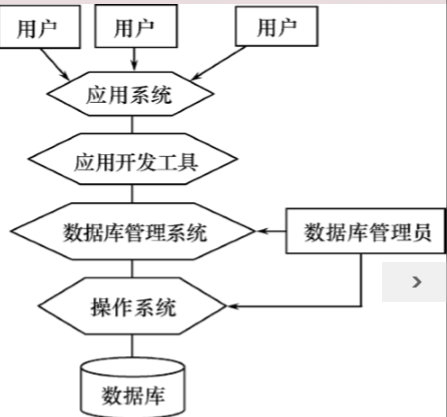

## 1. 硬件平台及数据库

> -  数据库系统对硬件资源的要求 
>   - 足够大的内存 
>   - 足够的大的磁盘或磁盘阵列等外部设备 
>   - 较高的通道能力，提高数据传送率 

## 2.  软件

> - 数据库管理系统 
> - 支持数据库管理系统运行的操作系统 
> - 与数据库接口的高级语言及其编译系统 
> - 以数据库管理系统为核心的应用开发工具 
> - 为特定应用环境开发的数据库应用系统 

## 3.  人员

> - 数据库管理员 
> - 系统分析员和数据库设计人员 
> - 应用程序员 
> - 最终用户  
>
> 不同的人员涉及不同的数据抽象级别，具有不同的数据视图 

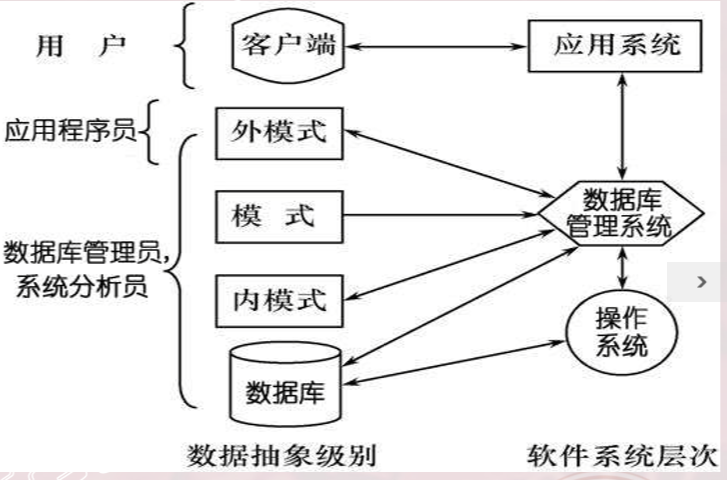

### 3.1 数据库管理员（DBA)

> 1. 参与确定数据库中的信息内容和结构 
> 2. 参与数据库的存储结构和存取策略的设计 
> 3. 参与确定数据安全性要求和完整性约束条件 
> 4. 监控数据库的使用和运行 
>    - 周期性转储数据库  数据文件 日志文件
>    - 系统故障恢复 
>    - 介质故障恢复 
>    - 监视审计文件  
> 5. 数据库的改进和重组 
>    - 性能监控和调优 
>    - 定期对数据库进行重组织， 以提高系统的性能  
>    -  需求增加和改变时，数据库 须需要重构造 

### 3.2 系统分析员

> 1. 负责应用系统的需求分析和规范说明 
> 2. 与用户及数据库管理员结合，确定系统的硬软件配置 
> 3. 参与数据库系统的概要设计 

### 3.3 数据库设计人员

> -  参加用户需求调查和系统分析 
> - 确定数据库中的数据 
> - 设计数据库各级模式  

### 3.4 应用程序员

> - 设计和编写应用系统的程序模块 
> - 进行调试和安装 

### 3.5 用户

> 用户是指最终用户（End User）。他们通过应用系统的用户接口使用数据库。  
>
> 1.  偶然用户  
>    - 不经常访问数据库，但每次访问数据库时往往需要不同的数据库信息  
>    -  企业或组织机构的高中级管理人员 
> 2.  简单用户 
>    -  主要工作是查询和更新数据库  
>    - 银行的职员、机票预定人员、旅馆总台服务员 
> 3.  复杂用户 
>    -  工程师、科学家、经济学家、科技工作者等 
>    -  直接使用数据库语言访问数据库，甚至能够基于数据库管理系统的应用 程序接口编制自己的应用程序 