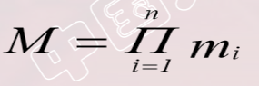
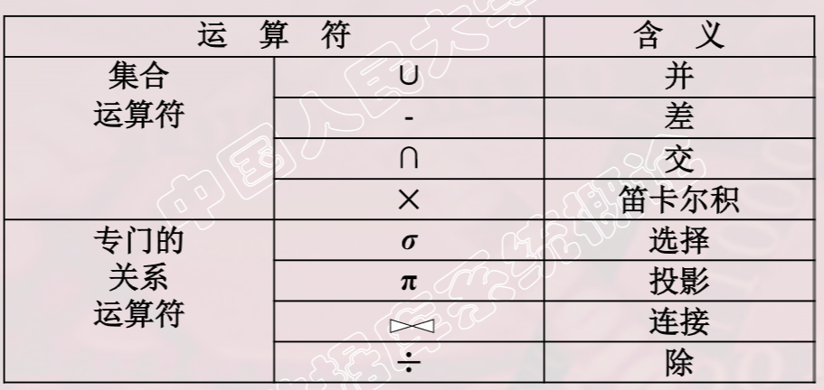
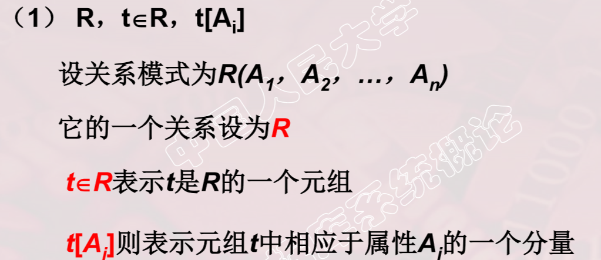
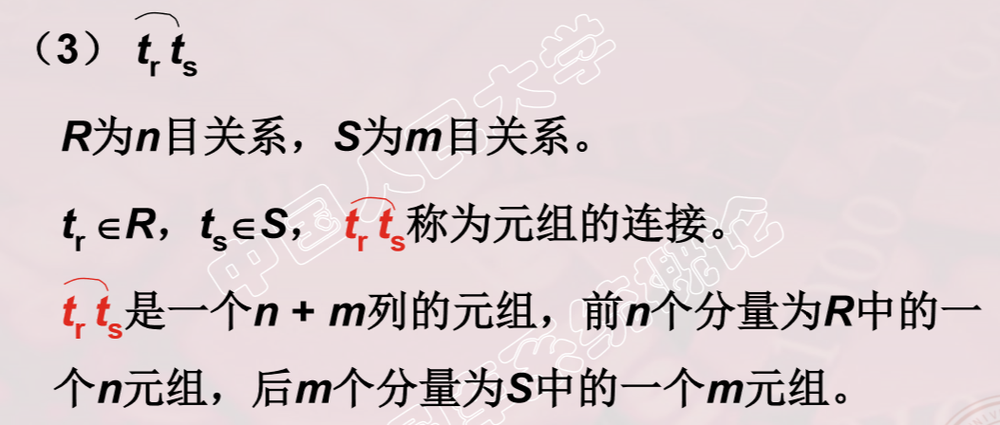
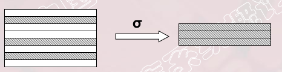
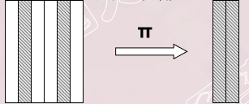
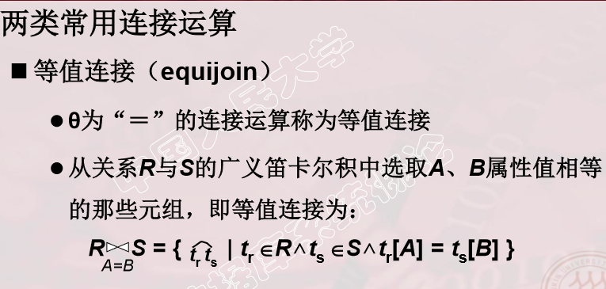
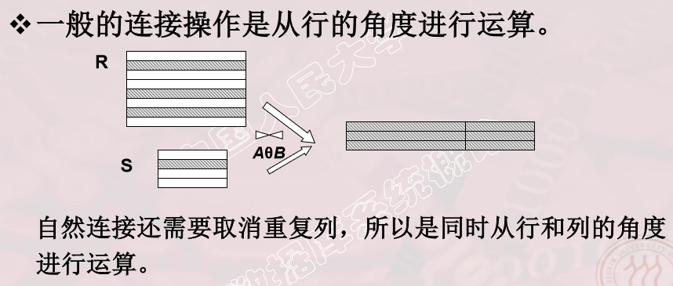
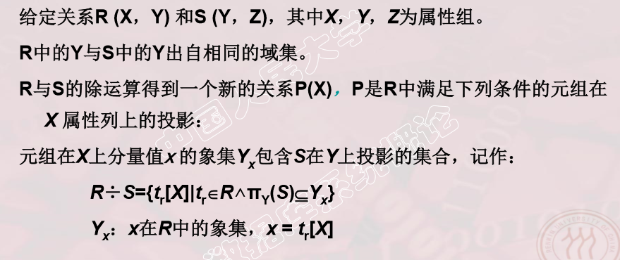

# 一、关系数据库简介

> - IBM公司的E.F.Codd于1970年提出关系数据模型 
>   - E.F.Codd, “A Relational Model of Data for Large  Shared Data Banks”, 《Communication of the  ACM》,1970 
> - 之后，提出了关系代数和关系演算的概念 

# 二、关系模型

## 1. 关系数据结构

### 1.1 关系

> - 域是一组具有相同数据类型的值的集合。
>   - 例: 整数 实数 介于某个取值范围的整数 指定长度的字符串集合 {‘男’，‘女’} 
> - 域的笛卡尔积空间 
>   - 给定一组域D1，D2，…，Dn，允许其中某些域是相同的。    
>     D1，D2，…，Dn的笛卡尔积空间为：    
>     D1×D2×…×Dn ＝｛（d1，d2，…，dn）｜di∈Di，i＝1，2，…，n｝ 
>   - 所有域取值的任意组合
>   - 笛卡尔积可以看着是关系的“域”。
>   - 基数（Cardinal number） 
>     若Di（i＝1，2，…，n）为有限集，其基数为mi（i＝1，2，…， n），则D1×D2×…×Dn的基数M为：  
>   - 笛卡尔积的表示方法 
>     - 笛卡尔积可表示为一张二维表 
>     - 表中的每行对应一个元组，表中的每列对应一个域 
> - 关系 
>   - D1×D2×…×Dn的子集叫作在域D1，D2，…，Dn上的 关系，表示为 
>              R（D1，D2，…，Dn）           
>     - R ： 关系名 
>     - n ： 关系的目或度（Degree） 
> - 元组 
>   - 关系中的每个元素（d1，d2，…，dn）叫作一个n元组（n-tuple） 或简称元组，通常用 t  表示。
> - 属性  
>   - 关系中不同列称为属性（Attribute），每个属性有一个名字 
>   - n目关系必有n个属性 
> - 码 
>   - 候选码（Candidate key）     
>     - 若关系中的某一属性组的值能唯一地标识一个元组，则称该属性组为候选码    
>     -  简单的情况：候选码只包含一个属性  
>   - 全码（All-key）     
>     - 最极端的情况：关系模式的所有属性组是这个关系模式的候选码， 称为全码（All-key） 
>   - 主码 
>     - 若一个关系有多个候选码，则选定其中一个为主码（Primary key） 
>   - 主属性
>     -  候选码的主属性称为主属性（Prime attribute） 不包含在任何侯选码中的属性称为非主属性（Non-Prime attribute）或 非码属性（Non-key attribute）  
> - 单元与二元关系
>   - 关系的度为1，2。 类似可定义多元关系
> - 基本关系的性质
>   - 列是同质的
>   - 不同的列可以出自同一个域
>   - 列的顺序可以任意交换
>   - 任意两个元祖的候选码不能相同
>   - 元祖的顺序可以交换
>   - 分量必须取原子值
>   - 关系必须是笛卡尔积的子集才有价值，全集价值不大

### 1.2 关系模式

> 关系模式（Relation Schema）是型、关系是值 
>
> 关系模式是对关系的描述  
>
> - 元组集合的结构 
>   - 属性构成 
>   - 属性来自的域            
>   - 属性与域之间的映象关系 
> - 完整性约束条件  
>
> 关系模式可以形式化地表示为：      R （ U ， D ， DOM ， F ）  
>
> -  R             关系名   
> - U             组成该关系的属性名集合   
> - D             U中属性所来自的域   
> - DOM        属性向域的映象集合   
> - F              属性间数据的依赖关系的集合 
>
> - 关系模式通常可以简记为   R (U)    或    R (A1 ， A2 ， … ，An) 
>   - R: 关系名 
>   -  A1，A2，…，An  : 属性名
>   -  注：域名及属性向域的映象常常直接说明为属性的类型、长度  

> 关系模式与关系的“关系” 
>
> - 关系模式：是对关系的描述，是静态的、稳定的 
> - 关系：是关系模式在某一时刻的状态或内容，是动 态的、随时间不断变化的  
> - 关系模式和关系往往笼统称为关系 

> - 关系数据库 
>   - 在一个给定的应用领域中，所有关系的集合构成一个关系数据库 
> - 关系数据库的型与值 
>   - 关系数据库的型: 关系数据库模式，是对关系数据库的描述 
>   - 关系数据库的值: 关系模式在某一时刻对应的关系的集合， 通常称为关系数据库 

## 2. 关系完整性约束

> - 实体完整性和参照完整性 
>   - 关系模型必须满足的完整性约束条件称为关系的两个不变性，应该由关系系统自动支持
> - 用户定义的完整性 
>   - 应用领域需要遵循的约束条件，体现了具体领域中的语义约束  

### 2.1 实体完整性

> - 关系的主属性不能取空值  
> - 空值就是“不知道”或“不存在”或“无意义”的值 
> -  说明 ：
>   - 实体完整性规则是针对基本关系而言的。一个基本表通常对应现实世界的一个实体集。 
>   - 现实世界中的实体是可区分的，即它们具有某种唯一性标识。 
>   - 关系模型中以主码作为唯一性标识。 
>   - 主码中的属性即主属性不能取空值。   
>   - 主属性取空值，就说明存在某个不可标识的实体，即存在不可区分的实体，这与第（2）点相矛盾，因此这个规则称为实体完整性  

### 2.2 参照完整性

> - 在关系模型中实体及实体间的联系都是用关系来描述的， 自然存在着关系与关系间的引用。 
> - 设F是基本关系R的一个或一组属性，但不是关系R的码。 如果F与基本关系S的主码Ks相对应，则称F是R的外码 。
>   - 基本关系R 称 为参照关系（Referencing  Relation）  
>   - 基本关系S 称 为被参照关系（Referenced Relation）或目标关系（Target Relation） 
>   - 关系R和S不一定是不同的关系 
>   - 目标关系S的主码Ks 和参照关系的外码F必须定义 在同一个（或一组）域上 
>   - 外码并不一定要与相应的主码同名。当外码与相应的主码属于不同关系时，往往取相同的名字，以便于识别  

### 2.3 用户定义的完整性

> - 针对某一具体关系数据库的约束条件，反映某一 具体应用所涉及的数据必须满足的语义要求 
> - 关系模型应提供定义和检验这类完整性的机制，以便用统一的系统的方法处理它们，而不需由应用程序承担这一功能 

# 三、关系代数

## 1. 关系数据库语言的分类 

> - 关系代数语言 
>   - 用对关系的运算来表达查询要求 
> - 关系演算语言：用谓词来表达查询要求
>   -  元组关系演算语言 
>     - 谓词变元的基本对象是元组变量 
>     - 代表：APLHA, QUEL 
>   - 域关系演算语言     
>     - 谓词变元的基本对象是域变量 
>     - 代表：QBE 
> - 具有关系代数和关系演算双重特点的语言 
>   - 代表：SQL（Structured Query Language

## 2. 关系代数

> - 关系代数是一种抽象的查询语言，它用对关系的 运算来表达查询 
> - 关系代数 
>   - 运算对象是关系 
>   - 运算结果亦为关系 
>   - 关系代数的运算符有两类：集合运算符和专门的关系运算符 

### 2.1 一些记号

### 2.2 并运算

> - R和S 
>   - 具有相同的目n（即两个关系都有n个属性） 
>   - 相应的属性取自同一个域  
>   - R∪S  仍为n目关系，由属于R或属于S的元组组成              
>   - R∪S = { t|t ∈ R∨t ∈S }  

### 2.3 交运算

> - R和S 
>   - 具有相同的目n 
>   - 相应的属性取自同一个域  
>   - R∩S 仍为n目关系，由既属于R又属于S的元组组成               
>   - R∩S = { t|t ∈ R∧t ∈S }            
>   - R∩S = R –(R-S） 

### 2.4 差运算

> - R和S 
>   - 具有相同的目n 
>   - 相应的属性取自同一个域  
>   - R - S  仍为n目关系，由属于R而不属于S的所有元组组成                 
>   - R -S = { t|t∈R∧t∉S } 

### 2.5 笛卡尔积

> - R: n目关系，k1个元组； 
> - S: m目关系，k2个元组 
> - R×S  列：（n+m）列元组的集合 
>   - 元组的前n列是关系R的一个元组 
>   - 后m列是关系S的一个元组 
>   - 行：k1×k2个元组 
>   - R×S = {tr ts |tr ∈R ∧ ts∈S } 

### 2.6 选择

> - 选择又称为限制（Restriction） 
> - 选择运算符的含义 
>   - 在关系R中选择满足给定条件的诸元组 σF(R) = {t|t∈R∧F(t)= '真'} 
>   - F：选择条件，是一个逻辑表达式，取值为“真” 或“假” 
>     - 基本形式为：X1θY1 
>     - θ表示比较运算符，它可以是＞，≥，＜，≤，＝或<

### 2.7 投影

> - 从R中选择出若干属性列组成新的关系 
> - πA(R) = { t[A] | t ∈R }，A ： R中的属性列  
> - 投影操作主要是从列的角度进行运算
> - 投影之后不仅取消了原关系中的某些列，而且还可能 取消某些元组（避免重复行）

### 2.8 连接

### 2.9 除运算

# 四、关系演算

> -  关系演算 
>   - 以数理逻辑中的谓词演算为基础  
> - 按谓词变元不同 进行分类 
>   - 元组关系演算：    
>     - 以元组变量作为谓词变元的基本对象    
>     - 元组关系演算语言ALPHA 
>   - 域关系演算：    
>     - 以域变量作为谓词变元的基本对象   
>     - 域关系演算语言QBE 

### 1. 元组关系演算

> - 语句格式
>
>   -  GET 工作空间名（定额） (表达式1) [：条件] [DOWN | UP 表达式2 ]       
>   - 表达式1：指定语句的操作对象 
>     - 格式：关系名| 关系名. 属性名| 元组变量. 属性名| 集函数 [，…  ] 
>   - 条件：结果元组应该满足的条件 
>     - 格式：逻辑表达式 
>   - 表达式2：指定排序方式         
>     - 格式：关系名. 属性名| 元组变量. 属性名[，…  ] 
>
> - 示例
>
>   -  GET  W (3)  (Student.Sno，Student.Sage	:Student.Sdept='IS' DOWN Student.Sage 
>
> - 元组关系演算:以元组变量作为谓词变元的基本对象  
>
>   - 元组变量的含义 表示可以在某一关系范围内变化 也称为范围变量Range Variable 
>   - 元组变量的用途 
>     - ① 简化关系名：设一个较短名字的元组变量来代替较长的关系名。 
>     - ② 条件中使用量词时必须用元组变量。 
>   -  定义元组变量  
>     - 格式：RANGE  关系名  变量名 
>     -  一个关系可以设多个元组变量 
>
> - 示例
>
>   - RANGE 	 Course  CX             
>
>      				SC         SCX 
>
>     GET  W  (Student.Sname): CX ∃SCX (SCX.Sno=Student.Sno∧SCX.Cno=CX.Cno)
>
> - 引入元组变量后，条件查询里面的条件就可以用谓词演算来表示

> -  常用聚集函数（Aggregation function）或内部函数（Build-in function） 
> - 示例
>   -   GET  W  ( COUNT(Student.Sdept) )  
>   -   GET  W  (AVG(Student.Sage):   Student.Sdept='IS’  )   

| 函数名 | 功能       |
| ------ | ---------- |
| COUNT  | 对元组计数 |
| TOTAL  | 求总和     |
| MAX    | 求最大值   |
| MIN    | 求最小值   |
| AVG    | 求平均值   |

### 2.  域关系演算

> 老师以图表化演示该语言，详见本目录下: 域关系演算语言.pdf

<a href="./域关系演算语言.pdf">域关系演算<a>

