# 一、SQL概述

> - SQL（Structured Query Language）
>   结构化查询语言，是关系数据库的标准语言

## 1. SQL 历史

> - 1970年Codd提出了关系模型之后，由于关系代数或者关系 都太数学了，难以被普通用户接受，于是1973年IBM开展 了System R的研制工作 。
> - System R 以关系模型为基础，但是摈弃了数学语言，以自 然语言为方向，结果诞生了结构化英语查询语言 （Structured English Query Language，SEQUEL）， 负责人为Don Chamberlin博士。 
> - 后来更名为SQL，发音不变。  System R获得1988年度ACM“软件系统奖”。

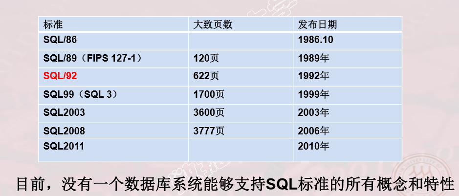


## 2. SQL 特点

> -  综合统一 
>
>   - 集数据定义语言（DDL），数据操纵语言（DML），数据控制语 言（DCL）功能于一体。
>   - 可以独立完成数据库生命周期中的全部活动： 
>     - 定义和修改、删除关系模式，定义和删除视图，插入数据，建 立数据库; 
>     - 对数据库中的数据进行查询和更新; 
>     - 数据库重构和维护 
>     - 数据库安全性、完整性控制，以及事务控制 
>     - 嵌入式SQL和动态SQL定义
>
> - 高度非过程化
>
>   -  非关系数据模型的数据操纵语言“面向过程”，必须指定存取路径。
>   -  SQL只要提出“做什么”，无须了解存取路径。
>   - 存取路径的选择以及SQL的操作过程由系统自动完成。
>
> -  面向集合的操作方式
>
>   -  非关系数据模型采用面向记录的操作方式，操作对象是一条记录
>   -  SQL采用集合操作方式
>   -  操作对象、查找结果可以是元组的集合
>   -  一次插入、删除、更新操作的对象可以是元组的集合
>
> - 以同一种语法结构提供多种使用方式
>
>   -  SQL是独立的语言
>     能够独立地用于联机交互的使用方式
>   - SQL又是嵌入式语言
>     SQL能够嵌入到高级语言（例如C，C++，Java）程序中，供程序员设计程序时使用
>
> - 语言简洁，易学易用
>
>   - SQL功能极强，完成核心功能只用了9个动词。
>
>   - | SQL 的动词  | SQL 功  能             |
>     | ----------- | ---------------------- |
>     | 数 据 查 询 | SELECT                 |
>     | 数据定义    | CREATE，DROP，ALTER    |
>     | 数 据 操 纵 | INSERT，UPDATE，DELETE |
>     | 数 据 控 制 | GRANT，REVOKE          |

## 3. SQL的基本概念

> SQL支持关系数据库三级模式结构

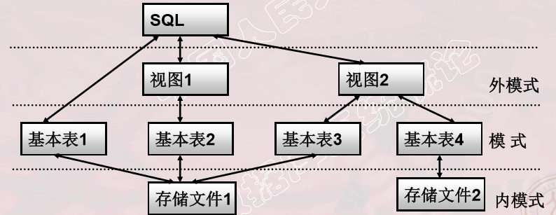

> - 基本表 
>   - 本身独立存在的表
>   - SQL中一个关系就对应一个基本表
>   - 一个（或多个）基本表对应一个存储文件
>   - 一个表可以带若干索引
> - 存储文件
>   - 逻辑结构组成了关系数据库的内模式
>   - 物理结构对用户是隐蔽的
> - 视图 
>   - 从一个或几个基本表导出的表
>   - 数据库中只存放视图的定义而不存放视图对应的数据
>   - 视图是一个虚表
>   - 用户可以在视图上再定义视图

# 二、数据定义

> - SQL的数据定义功能: 定义各种数据库的“对象” 
>   - 模式定义 
>   - 表定义 
>   - 视图定义 
>   - 索引定义

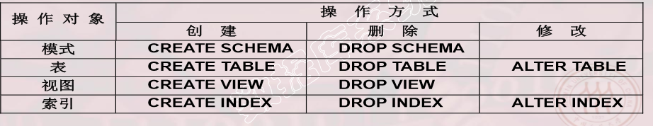

> - 现代关系数据库管理系统 提供了一个层次化的数据 库对象命名机制 
>   - 一个数据库中可以建立多个 模式 
>   - 一个模式下通常包括多个表、 视图和索引等数据库对象

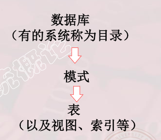

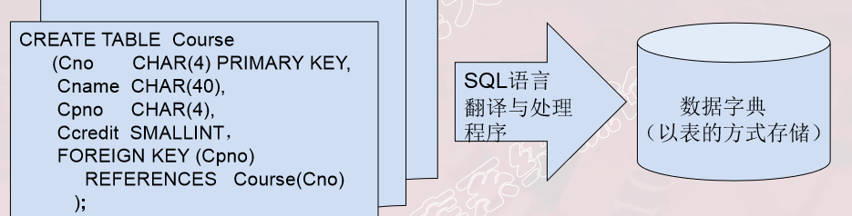

> - 数据字典是关系数据库管理系统内部的一组系统表，它记 录了数据库中所有对象的定义信息以及一些统计信息： 
>   - 关系模式、表、视图、索引的定义 
>   - 完整性约束的定义 
>   - 各类用户对数据库的操作权限 
>   - 统计信息等 
> - 关系数据库管理系统在执行SQL的数据定义语句时，实际 上就是在更新数据字典表中的相应信息。

## 1. 模式操作

> -  定义模式实际上定义了一个命名空间（或者说目录）。 
> - 在这个空间中可以定义该模式包含的数据库对象，例如基 本表、视图、索引等。 
> - 在CREATE SCHEMA中可以接受CREATE TABLE， CREATE VIEW和GRANT子句。
> - CREATE SCHEMA <模式名> AUTHORIZATION <用户名>[<表定义 子句>|<视图定义子句>|<授权定义子句>]
> -  DROP SCHEMA <模式名> <CASCADE|RESTRICT>
>   - CASCADE（级联）
>     - 删除模式的同时把该模式中所有的数据库对象全部删除
>   - RESTRICT（限制）
>     - 如果该模式中定义了下属的数据库对象（如表、视图 等），则拒绝该删除语句的执行。
>     - 仅当该模式中没有任何下属的对象时才能执行。

## 2. 表操作

> - 定义基本表 
>
>   - CREATE TABLE <表名> /* 基本表的名称 */ (<列名> <数据类型>[ <列级完整性约束条件> ] /*组成该表的列*/ [,<列名> <数据类型>[ <列级完整性约束条件>] ] …
>     [,<表级完整性约束条件> ] );
>     - <列级完整性约束条件>：涉及相应属性列的完整性约束条件 
>     -  <表级完整性约束条件>：涉及一个或多个属性列的完整性约束条件  
>     - 如果完整性约束条件涉及到该表的多个属性列，则必须定义在表级上。
>
> - 示例：
>
>   - CREATE TABLE  SC (
>
>     Sno  CHAR(9),
>
>      Cno  CHAR(4),  
>
>     Grade  SMALLINT， 
>
>     PRIMARY KEY (Sno,Cno),  /* 主码由两个属性构成，必须作为表级完整性进行定义*/ 
>
>     *FOREIGN KEY (Sno) REFERENCES Student(Sno), /* 表级完整性约束条件，Sno是外码，被参照表是Student*/ 
>
>     FOREIGN KEY (Cno)REFERENCES Course(Cno) /* 表级完整性约束条件， Cno是外码，被参照表是Course*/ );
>
> - 修改表
>
>   - ALTER TABLE <表名>
>     [ADD[COLUMN] <新列名> <数据类型> [ 完整性约束 ] ]
>     [ADD <表级完整性约束>]
>     [DROP [ COLUMN ] <列名> [CASCADE| RESTRICT] ]
>     [DROP CONSTRAINT<完整性约束名>[ RESTRICT | CASCADE ] ]
>     [ALTER COLUMN <列名><数据类型> ] ;
>   - <表名>是要修改的基本表  
>   - ADD子句用于增加新列、新的列级完整性约束条件和新的表级完整 性约束条件  
>   - DROP COLUMN子句用于删除表中的列 
>     -  如果指定了CASCADE短语，则自动删除引用了该列的其他对象 
>     -  如果指定了RESTRICT短语，则如果该列被其他对象引用，关系数据库 管理系统将拒绝删除该列 
>   - DROP CONSTRAINT子句用于删除指定的完整性约束条件 
>   - ALTER COLUMN子句用于修改原有的列定义，包括修改列名和数据 类型
>
> - DROP TABLE <表名>［RESTRICT| CASCADE］; 
>
>   -  RESTRICT：删除表是有限制的。
>     -  欲删除的基本表不能被其他表的约束所引用
>     -  如果存在依赖该表的对象，则此表不能被删除
>   - CASCADE：删除该表没有限制。
>     -  在删除基本表的同时，相关的依赖对象一起删除
>   - 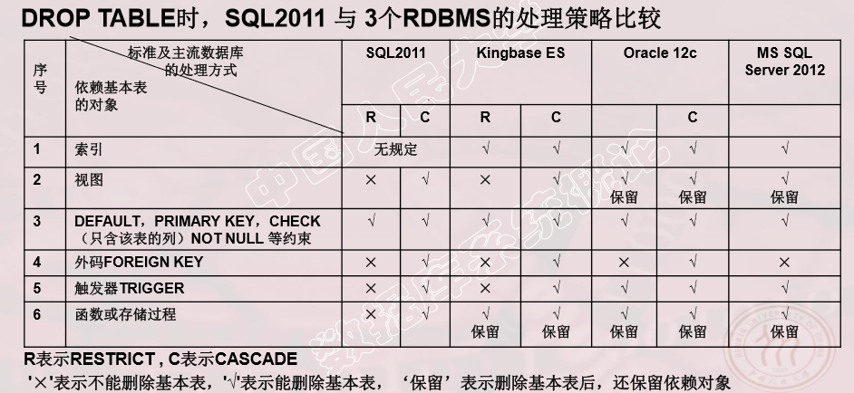

## 3. 数据类型

> - 关系模型中“域”的概念用数据类型来实现
>   - 定义表的属性时需要指明其数据类型及长度
>   - 选用哪种数据类型
>     - 取值范围
>     - 要做哪些运算
> - 不同的数据库不一样，具体参见参考手册

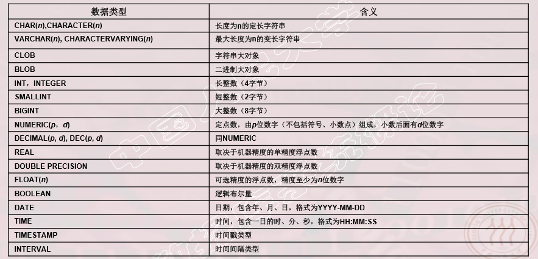

## 4. 模式与表

> - 每一个基本表需属于某个模式 
>
> - 定义基本表所属模式的方式：
>
>   - 方法一：在表名中明显地给出模式名 
>
>   - Create table"S-T".Student(......);     /*模式名为 S-T*/ 
>
>     
>
>   - 方法二：在创建模式的同时创建表
>
>   - 方法三：设置所属的模式
>
> -  创建基本表（其他数据库对象也一样）时，若没有指定模式，系统根据搜索路径来确定该对象所属的模式 
>
> - 关系数据库管理系统会以“搜索路径”指向的模式作为数 据库对象的模式名
>
> - 设置搜索路径的方式：
>   SET search_path TO "S-T",PUBLIC

## 5. 索引

> - 建立索引的目的：加快查询速度 
> - 关系数据库管理系统中常见索引： 
>   - 顺序文件上的索引 
>   - B+树索引（参见爱课程网3.2节动画《B+树的增删改》） 
>   - 散列（hash）索引 
>   - 位图索引 
>   - 特点： 
>     - B+树索引具有动态平衡的优点 
>     - HASH索引具有查找速度快的特点
> -  谁可以建立索引
>   - 数据库管理员 或 表的属主（即建立表的人）
> - 谁维护索引
>   - 关系数据库管理系统自动完成
> - 使用索引
>   - 关系数据库管理系统自动选择合适的索引作为存取路径，用户不必也不能显式地选择索引
> - 语句格式
>   -  CREATE [UNIQUE] [CLUSTER] INDEX <索引名>
>     ON <表名>(<列名>[<次序>][,<列名>[<次序>] ]…); 
>   - <表名>：要建索引的基本表的名字 
>   - 索引：可以建立在该表的一列或多列上，各列名之间用逗号分隔 
>   - <次序>：指定索引值的排列次序，升序：ASC，降序：DESC。缺省 值：ASC 
>   - UNIQUE：此索引的每一个索引值只对应唯一的数据记录
>   - CLUSTER：表示要建立的索引是聚簇索引
>   - ALTER INDEX <旧索引名> RENAME TO <新索 引名>
>   - DROP INDEX <索引名>; 

# 三、数据查询

## 1. 单表查询

> - 语句格式
>   SELECT [ALL|DISTINCT] <目标列表达式>[,<目标列表达式>] …
>   FROM <表名或视图名>[,<表名或视图名> ]…|(SELECT 语句)[AS]<别名>
>   [ WHERE <条件表达式> ]
>   [ GROUP BY <列名1> 
>   [ HAVING <条件表达式> ] ]
>   [ ORDER BY <列名2> [ ASC|DESC ] ];
> - 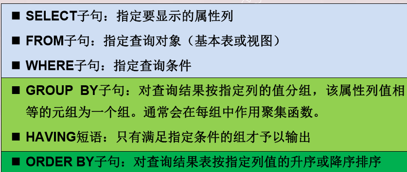

> - 序列
>   - SELECT Sname,2016-Sage FROM Student;
> - 别名
>   - SELECT Sname NAME,'Year of Birth:' BIRTH, 2014-Sage BIRTHDAY,LOWER(Sdept) DEPARTMENT FROM Student; 
> - 查询全部列 
>   - SELECT * FROM Student;
> - 消除取值重复的行 
>   - SELECT DISTINCT Sno FROM SC; 
> - 条件查询
>   - SELECT Sname, Sdept, Sage FROM Student WHERE   Sage BETWEEN 20 AND 23; 
>   - 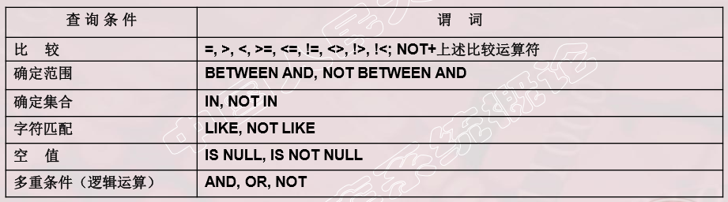
>   - SELECT Sname, Ssex FROM  Student WHERE Sdept IN ('CS','MA’,'IS' );
>   - SELECT Sname FROM   Student WHERE  Sname LIKE '欧阳__';
>     -  % （百分号） 代表任意长度（长度可以为0）的字符串 例如a%b表示以a开头，以b结尾的任意长度的字符串 
>     -  _ （下横线） 代表任意单个字符。 例如a_b表示以a开头，以b结尾的长度为3的任意字符串
> - 使用换码字符将通配符转义为普通字符
>   - SELECT Cno，Ccredit FROM     Course WHERE  Cname LIKE 'DB\_Design' ESCAPE '\ ' ;
> -  IS NULL 或 IS NOT NULL 
>   - “IS” 不能用 “=” 代替
>   - SELECT Sno，Cno FROM     SC WHERE  Grade IS NOT NULL;
> - 逻辑运算符：AND和 OR来连接多个查询条件
>   - AND的优先级高于OR
>   - 可以用括号改变优先级 
> - ORDER BY子句
>   - 可以按一个或多个属性列排序
>   - 升序：ASC;降序：DESC;缺省值为升序
>   - 对于空值，排序时显示的次序由具体系统实现来决定
> - 聚集函数： 
>   -  统计元组个数 
>     - COUNT(*)  
>   - 统计一列中值的个数 
>     - COUNT([DISTINCT|ALL] <列名>) 
>   - 计算一列值的总和（此列必须为数值型）
>     - SUM([DISTINCT|ALL] <列名>) 
>   - 计算一列值的平均值（此列必须为数值型） 
>     - AVG([DISTINCT|ALL] <列名>) 
>   - 求一列中的最大值和最小值 
>     - MAX([DISTINCT|ALL] <列名>)
>     - MIN([DISTINCT|ALL] <列名>)
>   - SELECT SUM(Ccredit) FROM  SC,Course WHERE Sno='201215012' AND SC.Cno=Course.Cno; 
> - GROUP BY子句分组：
>   - 细化聚集函数的作用对象
>   -  如果未对查询结果分组，聚集函数将作用于整个查询结果
>   -  对查询结果分组后，聚集函数将分别作用于每个组
>   - 按指定的一列或多列值分组，值相等的为一组
>   - SELECT Cno，COUNT(Sno) FROM SC GROUP BY Cno;
>   - SELECT  Sno, AVG(Grade) FROM  SC GROUP BY Sno HAVING AVG(Grade)>=90;
> - HAVING短语与WHERE子句的区别： 
>   - 作用对象不同 
>   - WHERE子句作用于基表或视图，从中选择满足条件的元组 
>   - HAVING短语作用于组，从中选择满足条件的组。
> - SELECT Sdept, Ssex,COUNT(Sno) FROM  Student GROUP BY Sdept,Ssex ORDER BY COUNT(Sno) DESC;

## 2. 连接查询

> - 不像关系代数中“连接”是用一个特殊符号来表达的，在 SQL中“连接”是用“连接条件”来表达的。
> - 连接条件或连接谓词：用来连接两个表的条件   
>   - 一般格式：  [<表名1>.]<列名1>  <比较运算符>  [<表名2>.]<列名2> 
>
> - 连接字段：连接谓词中的列名称 
>   - 连接条件中的各连接字段类型必须是可比的，但名字不必相同 
> - 等值连接：连接运算符为 “=” 
>   -  SELECT  Student.*, SC.*            FROM     Student, SC            WHERE  Student.Sno = SC.Sno; 
> - 自然连接 
>   - 采用在SELECT中去掉重复字段的方式实施 
>   - SELECT  Student.Sno,Sname,Ssex,Sage,Sdept,Cno,Grade  FROM     Student,SC  WHERE  Student.Sno = SC.Sno; 
> - 连接操作的执行过程 
>   - 嵌套循环法（NESTED-LOOP） 
>     - 首先在表1中找到第一个元组，然后从头开始扫描表2，逐一查找满足 连接件的元组，找到后就将表1中的第一个元组与该元组拼接起来， 形成结果表中一个元组。  
>     - 表2全部查找完后，再找表1中第二个元组，然后再从头开始扫描表2 ，逐一查找满足连接条件的元组，找到后就将表1中的第二个元组与 该元组拼接起来，形成结果表中一个元组。 
>     - 重复上述操作，直到表1中的全部元组都处理完毕   
>   - 排序合并法（SORT-MERGE） 
>     - 常用于等值连接 
>     - 首先按连接属性对表1和表2排序。 
>     - 设置指针，分别指向表1和表2的第一个元组。
>     - 如果这两个元组满足 连接条件，则进行元组拼接（如果有多个连续元组满足连接条件， 则需要一一拼接），并将两指针分别后移一个原则。否则，将具有 较小值的指针后移一个元组  重复上述操作，直到表1或表2中的全部元组都处理完毕为止   
>   - 索引连接（INDEX-JOIN） 
>     - 对表2按连接字段建立索引
>     -  对表1中的每个元组，依次根据其连接字段值查询表2的索引，从 中找到满足条件的元组，找到后就将表1中的第一个元组与该元 组拼接起来，形成结果表中一个元组 
>     - （该方法可以视作嵌套循环法的一个变种） 
> - 自身连接：
>   - 一个表与其自己进行连接，是一种特殊的连接 
>   - 需要给表起别名以示区别 
>   - 由于所有属性名都是同名属性，因此必须使用别名前缀 
> - 外连接
>   - 外连接与普通连接的区别 
>     - 普通连接操作只输出满足连接条件的元组 
>     - 外连接操作以指定表为连接主体，将主体表中不满足连接条件的元组一并输出 
>     - 左外连接 
>       - 列出左边关系中所有的元组  
>     - 右外连接 
>       - 列出右边关系中所有的元组  
>   - SELECT Student.Sno,Sname,Ssex,Sage,Sdept,Cno,Grade     
>     FROM  Student  LEFT OUT JOIN SC ON  (Student.Sno=SC.Sno);  
> - 多表连接
>   -  SELECT Student.Sno, Sname, Cname, Grade    
>     FROM    Student, SC, Course    /*多表连接*/    
>     WHERE Student.Sno = SC.Sno AND SC.Cno = Course.Cno; 

## 3. 嵌套查询

> - 一个SELECT-FROM-WHERE语句称为一个查询块 ◼
> - 将一个查询块嵌套在另一个查询块的WHERE子句 或HAVING短语的条件中的查询称为嵌套查询 
> - SELECT Sname /*外层查询/父查询*/ 
>   FROM Student WHERE Sno IN ( SELECT Sno        /*内层查询/子查询*/ 
>   FROM SC WHERE Cno= ' 2 ');
>
> - 上层的查询块称为外层查询或父查询
> - 下层查询块称为内层查询或子查询
> - QL语言允许多层嵌套查询
> - 子查询的限制
>
> - 不能使用ORDER BY子句
> - 不相关子查询： 
>   - 子查询的查询条件不依赖于父查询
>   - 由里向外 逐层处理。即每个子查询在上一级查询处理
>     之前求解，子查询的结果用于建立其父查询的查找条
>     件。
>   - SELECT Sno, Sname, Sdept FROM Student WHERE Sdept  IN (SELECT Sdept FROM Student WHERE Sname= ' 刘晨 '); 
>
> - 相关子查询：
>   - 子查询的查询条件依赖于父查询
>   - 首先取外层查询中表的第一个元组，根据它与内层查
>     询相关的属性值处理内层查询，若WHERE子句返回值
>     为真，则取此元组放入结果表
>   - 然后再取外层表的下一个元组
>   - 重复这一过程，直至外层表全部检查完为止
>   - SELECT Sno, Cno FROM    SC  x WHERE Grade >=(SELECT AVG（Grade） FROM  SC y WHERE y.Sno=x.Sno); 
> - 带谓词的子查询
>   - 在谓词逻辑中，还有存在量词和全称量词的概念， 在SQL中并没有对应的表达，统一采用“谓词” 来表达 
>     - 方法一：引入ANY和ALL谓词，其对象为某个查 询结果，表示其中任意一个值或者全部值
>     - 方法二：引入EXIST谓词，其对象也是某个查询结 果，但表示这个查询结果是否为空，返回真值
>   - 使用ANY或ALL谓词时必须同时使用比较运算 
>     - /--- >ANY 大于子查询结果中的某个值 
>     - /--- >ALL 大于子查询结果中的所有值
>     - /---  < ANY 小于子查询结果中的某个值 
>     - /---  < ALL 小于子查询结果中的所有值 >= ANY 大于等于子查询结果中的某个值 
>     - /---  >= ALL 大于等于子查询结果中的所有值
>     - /---   <= ANY 小于等于子查询结果中的某个值 
>     - /---  <= ALL 小于等于子查询结果中的所有值 
>     - /---  = ANY 等于子查询结果中的某个值 
>     - /---  =ALL 等于子查询结果中的所有值（通常没有实际意义） 
>     - /---  !=（或<>）ANY 不等于子查询结果中的某个值 
>     - /---  !=（或<>）ALL 不等于子查询结果中的任何一个值
>   - SELECT Sname,Sage FROM Student WHERE Sage < ALL (SELECT Sage FROM Student WHERE Sdept= ' CS ') AND Sdept <> ' CS ’;
>   - ANY（或SOME），ALL谓词与聚集函数、IN谓词的等 价转换关系 
>     - 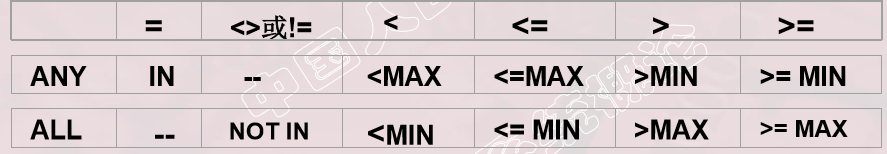
> -  EXISTS谓词 
>   -  带有EXISTS谓词的子查询不返回任何数据，只产生逻辑真值“true” 或逻辑假值“false”。 
>   - 若内层查询结果非空，则外层的WHERE子句返回真值 
>   - 若内层查询结果为空，则外层的WHERE子句返回假值 
>   - 由EXISTS引出的子查询，其目标列表达式通常都用 * ，因为带 EXISTS的子查询只返回真值或假值，给出列名无实际意义。
>   - SELECT Sname FROM Student WHERE EXISTS (SELECT * FROM SC WHERE Sno=Student.Sno AND Cno= ' 1 ');
>   -  用EXISTS代替其他谓词 
>     - 所有带IN谓词、比较运算符、ANY和ALL谓词的子查询都能用带 EXISTS谓词的子查询等价替换
>     - 用EXISTS/NOT EXISTS实现全称量词（难点）
>     -  用EXISTS实现逻辑蕴含 
>       - 可以把带有全称量词的谓词转换为等价的带有存在量词的谓词：
>   -  用EXISTS/NOT EXISTS实现逻辑蕴涵（难点）
>     - 

# 四、数据更新

## 1. 插入数据

> - 两种插入数据方式 
>
>   - 插入元组 
>   - 插入子查询结果 
>
> - 可以一次插入多个元组 
>
> - 语句格式 
>
>   -  INSERT  INTO <表名> [(<属性列1>[,<属性列2 >…)]  VALUES (<常量1> [,<常量2>]… ); 
>
>   - 功能  将新元组插入指定表中 
>
>   -  INTO子句
>
>     - 指定要插入数据的表名及属性列 
>     - 属性列的顺序可与表定义中的顺序不一致 
>     - 没有指定属性列：表示要插入的是一条完整的元组，且 属性列属性与表定义中的顺序一致
>     - 指定部分属性列：插入的元组在其余属性列上取空值 
>
>   - VALUES子句  
>
>     - 提供的值必须与INTO子句匹配 
>       - 值的个数 
>       - 值的类型 
>
>   - 语句格式     
>
>     - INSERT  INTO <表名>  [(<属性列1> [,<属性列2>…  )]       子查询;  
>
>     - INTO子句
>
>       - 子查询 SELECT子句目标列必须与INTO子句匹配 
>         - 值的个数 
>         - 值的类型  
>
>     - ```sql
>       INSERT  INTO  Dept_age(Sdept,Avg_age)               
>       SELECT  Sdept，AVG(Sage)               
>       FROM     Student               
>       GROUP BY Sdept; 
>       ```
>
>       
>
>     - ```sql
>       insert  into `t_user`(`u_id`,`u_name`,`u_age`,`u_email`) values 
>       (2,'zhangsan',20,'test2@baomidou.com'),
>       (3,'Tom',28,'test3@baomidou.com'),
>       (4,'Sandy',21,'test4@baomidou.com'),
>       (5,'Billie',24,'test5@baomidou.com'),
>       (77,'hello',18,NULL),
>       (222,'ssd',13,NULL);
>       ```
>
>     - 关系数据库管理系统在执行插入语句时会检查所插元组是否破坏表上已定义的完整性规则 
>
>       - 实体完整性 
>       - 参照完整性 
>       - 用户定义的完整性
>       - NOT NULL约束 
>       - UNIQUE约束 
>       - 值域约束 

## 2. 修改数据

> - 语句格式    
>   - UPDATE  <表名>     SET  <列名>=<表达式>[,<列名>=<表达式>]…     [WHERE <条件>];  
>   - 功能 
>     - 修改指定表中满足WHERE子句条件的元组 
>     - SET子句给出<表达式>的值用于取代相应的属性列 
>     - 如果省略WHERE子句，表示要修改表中的所有元组 
> - 关系数据库管理系统在执行修改语句时会检查修 改操作是否破坏表上已定义的完整性规则 

## 3. 删除数据

> - 语句格式         
>
> - DELETE  FROM     <表名>        [WHERE <条件>]; 
>
> - 功能 
>
>   - 删除指定表中满足WHERE子句条件的元组 
>   - WHERE子句 
>     - 指定要删除的元组 
>     - 无该子句将会删除表中的全部元组 
>
> - ```sql
>   DELETE   
>   FROM  SC   
>   WHERE  Sno  IN    
>   ( SELECT  Sno               
>    FROM   Student               
>    WHERE  Sdept= 'CS') ; 
>   ```

# 五、空值处理

> - 空值就是“不知道”或“不存在”或“无意义”的值。
>   - 一般有以下几种情况： 
>   - 该属性应该有一个值，但目前不知道它的具体值
>   - 该属性不应该有值 
>   - 由于某种原因不便于填写 
> - 空值是一个很特殊的值，含有不确定性。对关系运 算带来特殊的问题，需要做特殊的处理。
> - 空值的产生有其实际需求      
>   - 学生在选课后，产生选课表，但是还没有成绩。这时候成绩 部分就为空值，它和0不一样（不是0分） 
> - 判断一个属性的值是否为空值，用IS NULL或IS NOT NULL来表示。 
> - 属性定义（或者域定义）中 
>   - 有NOT NULL约束条件的不能取空值 
>   - 加了UNIQUE限制的属性不能取空值 
>   - 码属性不能取空值 
> - 空值与另一个值（包括另一个空值）的算术运算的结果为 空值 
> - 空值与另一个值（包括另一个空值）的比较运算的结果为 UNKNOWN。
> - 有UNKNOWN后，传统二值（TRUE，FALSE）逻辑就扩 展成了三值逻辑 
> - 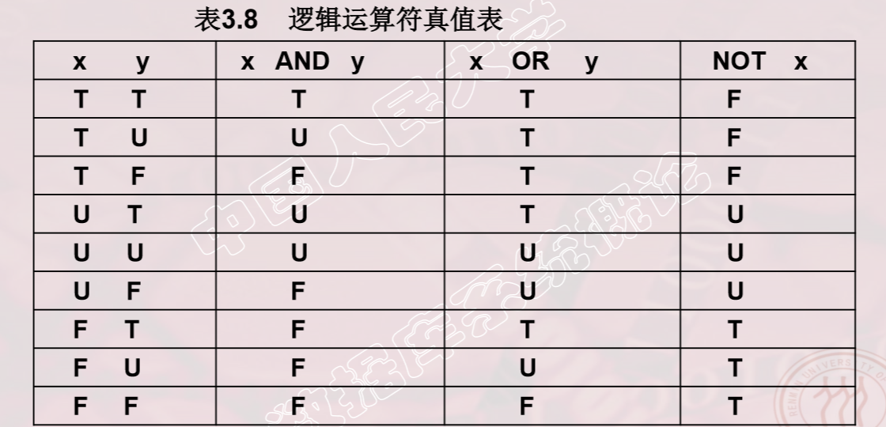

# 六、视图

> - 视图的特点
>   - 虚表，是从一个或几个基本表（或视图）导出的表
>   - 只存放视图的定义，不存放视图对应的数据
>   - 基表中的数据发生变化，从视图中查询出的数据也随之改变

##  1. 定义视图

**语句格式**

```sql
 CREATE  VIEW <视图名>  [(<列名>  [,<列名>]…)] AS <子查询> [WITH  CHECK  OPTION];
```

> - WITH CHECK OPTION对视图进行UPDATE，INSERT和DELETE操作时要保 证更新、插入或删除的行满足视图定义中的谓词条件 （即子查询中的条件表达式） 
> - 子查询可以是任意的SELECT语句，是否可以含 有ORDER BY子句和DISTINCT短语，则决定具体系统的实现。
> - 组成视图的属性列名：全部省略或全部指定
>   - 全部省略: 由子查询中SELECT目标列中的诸字段组成
>   - 明确指定视图的所有列名: 
>   - 某个目标列是聚集函数或列表达式 
>   - 多表连接时选出了几个同名列作为视图的字段 需要在视图中为某个列启用新的更合适的名字
> - 关系数据库管理系统执行CREATE VIEW语句时,只是把视图定义存入数据字典，并不执行其中的 SELECT语句。
> - 在对视图查询时，按视图的定义从基本表中将数据查出。

```sql
CREATE VIEW IS_Student 
AS 
SELECT Sno,Sname,Sage 
FROM  Student 
WHERE  Sdept= 'IS' 
WITH CHECK OPTION;
```

> - 定义IS_Student视图时加上了WITH CHECK OPTION子句，对该视图进行插入、修改和删除操作 时，RDBMS会自动加上Sdept='IS'的条件。 
> - 若一个视图是从单个基本表导出的，并且只是去掉 了基本表的某些行和某些列，但保留了主码，我们 称这类视图为行列子集视图。
> - IS_Student视图就是一个行列子集视图

**基于多个表的视图**

```sql
CREATE VIEW IS_S1(Sno,Sname,Grade) 
AS 
SELECT Student.Sno,Sname,Grade 
FROM  Student,SC 
WHERE  Sdept= 'IS' AND Student.Sno=SC.Sno AND SC.Cno= '1';
```

**基于视图的视图 **

```sql
CREATE VIEW IS_S2 AS SELECT Sno,Sname,Grade FROM  IS_S1 WHERE  Grade>=90;
```

**带表达式的视图**

```sql
CREATE  VIEW BT_S(Sno,Sname,Sbirth) AS SELECT Sno,Sname,2014-Sage FROM  Student;
```

**分组视图**

```sql
CREAT  VIEW S_G(Sno,Gavg) AS  SELECT Sno,AVG(Grade) FROM  SC GROUP BY Sno;
```

**没有不指定属性列**

```sql
CREATE VIEW F_Student(F_Sno,name,sex,age,dept) 
AS 
SELECT * 
FROM Student WHERE Ssex=‘女’;
-- 缺点： 修改基表Student的结构后，Student表与F_Student视图 的映象关系 被破坏，导致该视图不能正确工作。
```


## 2. 查询视图

> - 用户角度：查询视图与查询基本表相同
> - 关系数据库管理系统实现视图查询的方法
>   - 视图消解法（View Resolution）
>     - 进行有效性检查
>     - 转换成等价的对基本表的查询
>     - 执行修正后的查询
>     - 视图消解法的局限 
>       - 有些情况下，视图消解法不能生成正确的查询。 


## 3. 更新视图

> - 更新视图的限制：一些视图是不可更新的，因为 对这些视图的更新不能唯一地有意义地转换成对 相应基本表的更新
> - 允许对行列子集视图进行更新
> - 对其他类型视图的更新不同系统有不同限制


## 4. 删除视图

> - 语句的格式： DROP  VIEW  <视图名>[CASCADE]; 
> - 该语句从数据字典中删除指定的视图定义 
> - 如果该视图上还导出了其他视图，使用CASCADE级 联删除语句，把该视图和由它导出的所有视图一起删 除 
> - 删除基表时，由该基表导出的所有视图定义都必须显 式地使用DROP VIEW语句删除

## 4 . 视图的作用

> - 视图能够简化用户的操作
> - 视图使用户能以多种角度看待同一数据
> - 视图对重构数据库提供了一定程度的逻辑独立性
> - 视图能够对机密数据提供安全保护
> - 适当的利用视图可以更清晰的表达查询
> - 视图能够简化用户的操作
>   - 当视图中数据不是直接来自基本表时，定义视图能够简
>     化用户的操作
>   - 基于多张表连接形成的视图
>   - 基于复杂嵌套查询的视图
>   - 含导出属性的视图
> - 视图使用户能以多种角度看待同一数据
>   - 视图机制能使不同用户以不同方式看待同一数据，适应数据库共享的需要
> - 视图对重构数据库提供了一定程度的逻辑独立性
>   - 数据库重构 
>   - 视图只能在一定程度上提供数据的逻辑独立性 
>   - 由于对视图的更新是有条件的，因此应用程序中修改数据的 语句可能仍会因基本表结构的改变而改变
> - 视图能够对机密数据提供安全保护 
>   - 对不同用户定义不同视图，使每个用户只能看到他有权看 到的数据