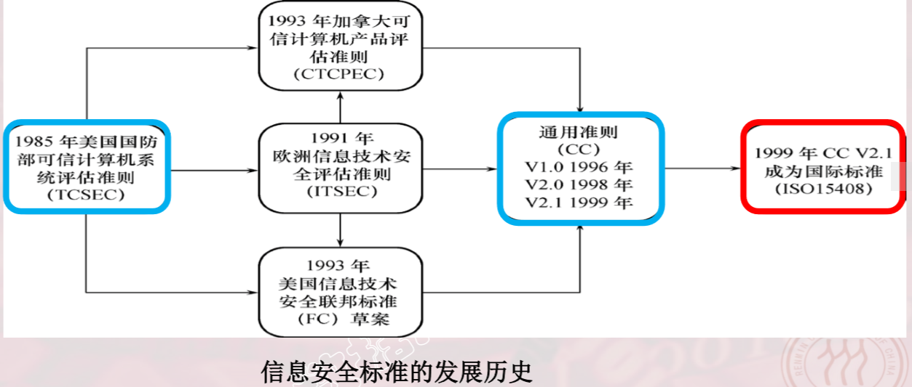
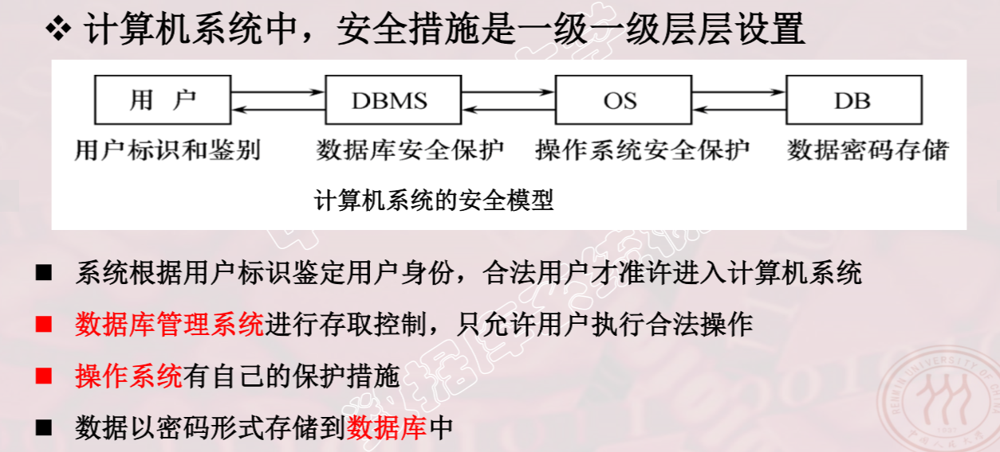
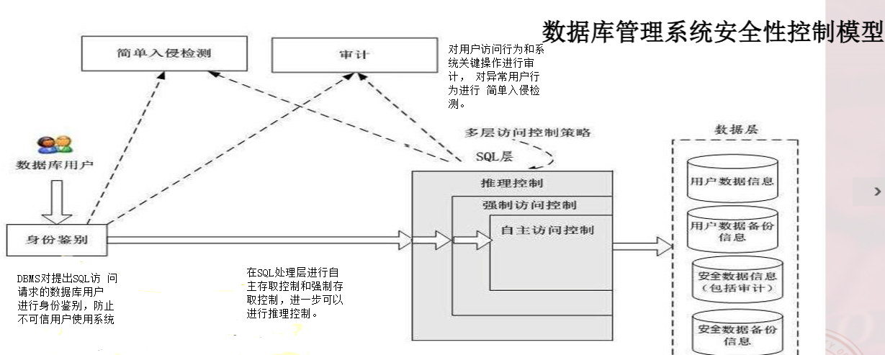
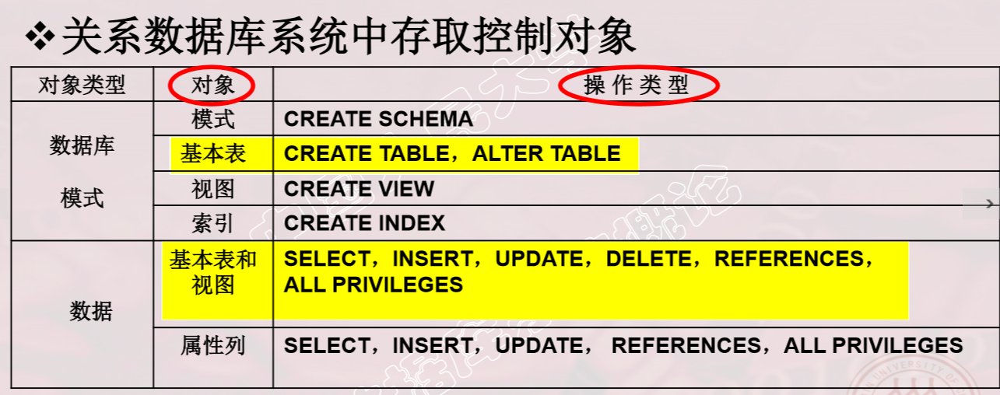
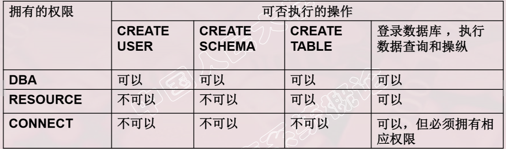
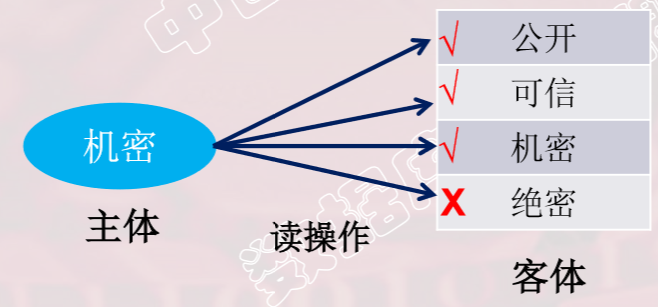
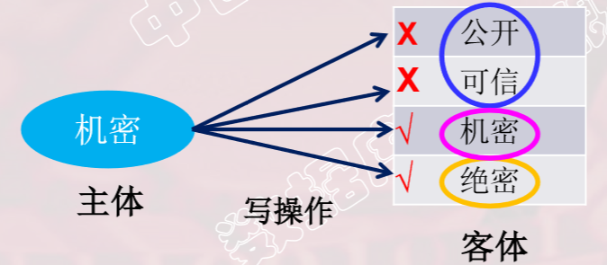
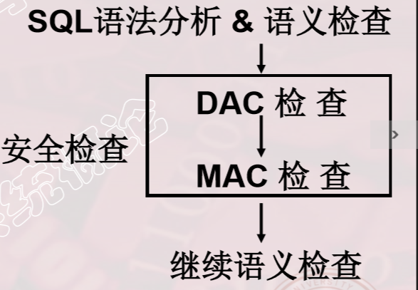
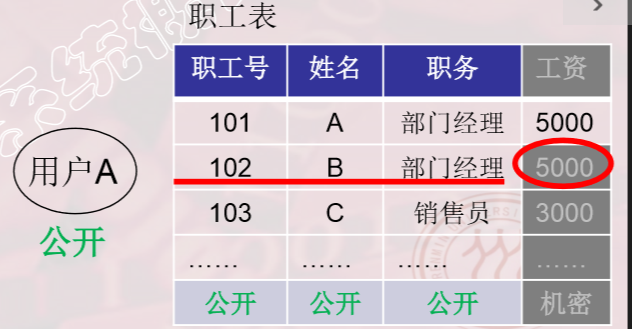
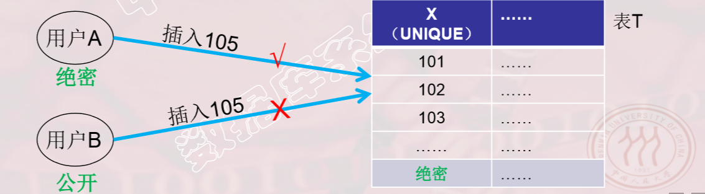

# 一、数据库安全性概述

## 1. 数据库不安全的因素

> -  问题的提出 
>   - 数据库的一大特点是数据可以共享 
>   - 数据共享必然带来数据库的安全性问题 
>   - 数据库系统中的数据共享不能是无条件的共享
>     -  例： 军事秘密、国家机密、新产品实验数据、         
>     - 市场需求分析、市场营销策略、销售计划、         
>     - 客户档案、医疗档案、银行储蓄数据 
> - 数据安全性
>   - 数据库的安全性是指保护数据库以防止不合法使用所 造成的数据泄露、更改或破坏 。
>   - 系统安全保护措施是否有效是数据库系统主要的性能 指标之一。
> - 数据库不安全的因素
>   - 非授权用户对数据库的恶意存取和破坏 
>     - 一些黑客（Hacker）和犯罪分子在用户存取数据库时 猎取用户名和用户口令，然后假冒合法用户偷取、修 改甚至破坏用户数据。
>     - 数据库管理系统提供的安全措施主要包括用户身份鉴 别、存取控制和视图等技术。 
>   - 数据库中重要或敏感的数据被泄露 
>     - 黑客和敌对分子千方百计盗窃数据库中的重要数据， 一些机密信息被暴露。
>     - 数据库管理系统提供的主要技术有强制存取控制、数 据加密存储和加密传输等。
>     - 审计日志分析
>   - 安全环境的脆弱性 
>     - 数据库的安全性与计算机系统的安全性紧密联系 
>       - 计算机硬件、操作系统、网络系统等的安全性 
>     - 建立一套可信（Trusted）计算机系统的概念和标准 


## 2. 安全标准简介（没有理解）



### TCSEC标准

> - 1991年4月美国NCSC（国家计算机安全中心） 颁布了《可信计算机系统评估标准关于可信数据 库系统的解释》（ Trusted Database Interpretation 简称TDI） 
> - TDI又称紫皮书。它将TCSEC扩展到数据库管理系统
> - TDI中定义了数据库管理系统的设计与实现中需满足和 用以进行安全性级别评估的标准 

### CC标准

> - 提出国际公认的表述信息技术安全性的结构 
>
> - 把信息产品的安全要求分为 
>   - 安全功能要求 
>   - 安全保证要求 

# 二、数据库安全性控制



> - 数据库安全性控制的常用方法 
>   - 用户身份鉴别 
>   - 存取控制 
>   - 视图 
>   - 审计 
>   - 数据加密 



> - 用户身份鉴别   （Identification &  Authentication）
>
>   - 系统提供的最外层安全保护措施 
>     - 用户标识：由用户名和用户标识号组成   （用户标识号在系统整个生命周期内唯一） 
>   - 用户身份鉴别的方法 
>     - 1.静态口令鉴别 
>       - 静态口令一般由用户自己设定，这些口令是静态不变的 
>     - 2.动态口令鉴别 
>       -  口令是动态变化的，每次鉴别时均需使用动态产生的新口令登录 数据库管理系统，即采用一次一密的方法 
>     - 3.智能卡鉴别 
>       - 智能卡是一种不可复制的硬件，内置集成电路的芯片，具有硬件 加密功能 
>     - 4.生物特征鉴别 
>       - 通过生物特征进行认证的技术，生物特征如指纹、虹膜和掌纹等 
>
> - 存取控制机制组成
>
>   - 定义用户权限，并将用户权限登记到数据字典中 
>     - 用户对某一数据对象的操作权力称为权限  
>     - DBMS提供适当的语言来定义用户权限，存放在数据字 典中，称做安全规则或授权规则  
>   - 合法权限检查  
>     - 用户发出存取数据库操作请求 
>     - DBMS查找数据字典，进行合法权限检查  
>   - 用户权限定义和合法权检查机制一起组成了DBMS的存取控制子系统 
>
> - 自主存取控制（Discretionary Access Control ， 简称DAC） 
>
>   - 用户对不同的数据对象有不同的存取权限
>   - 不同的用户对同一对象也有不同的权限 
>   - 用户还可将其拥有的存取权限转授给其他用户 
>   - 通过 SQL 的GRANT 语句和REVOKE 语句实现  
>   - 
>
> - 授权：授予与回收 
>
>   - GRANT语句的一般格式        
>     - GRANT <权限>[,<权限>]...         
>       ON <对象类型> <对象名>[,<对象类型> <对象名>]…        
>       TO <用户>[,<用户>]...        
>       [WITH GRANT OPTION];  
>     - [WITH GRANT OPTION] : 指定该子句：可以再转授权限 没有指定：不能传 ;不能循环传播
>     - 语义：将对指定操作对象的指定操作权限授予指定的用户播权
>     - 发出GRANT
>       - 数据库管理员 
>       - 数据库对象创建者（即属主Owner） 
>       - 拥有该权限的用户 
>     - 按受权限的用户  
>     - 一个或多个具体用户 PUBLIC（即全体用户）   
>   - 授予的权限可以由数据库管理员或其他授权者用 REVOKE语句收回
>     - REVOKE语句的一般格式为：     
>       REVOKE <权限>[,<权限>]...     
>       ON <对象类型> <对象名>[,<对象类型><对象名>]…     
>       FROM <用户>[,<用户>]...[CASCADE | RESTRICT]; 
>     - CASCADE：级联回收  回收全部传播
>     - RESTRICT：受限回收  回收可能失败
>
> - CREATE USER语句格式               
>
> - ```sql
>   CREATE  USER  <username>   [WITH][DBA|RESOURCE|CONNECT];  
>   ```
>
> - 注：CREATE USER不是SQL标准，各个系统的实现相差甚远 
>
> - 

> - 数据库角色：被命名的一组与数据库操作相关的权限 
>
>   - 角色是权限的集合  
>   - 可以为一组具有相同权限的用户创建一个角色 
>   - 简化授权的过程  
>
> - 角色的创建 CREATE  ROLE  <角色名>  
>
> - .给角色授权   GRANT  <权限>[,<权限>]…   ON <对象类型>对象名    TO <角色>[,<角色>]… 
>
> - 将一个角色授予其他的角色或用户 GRANT  <角色1>[,<角色2>]… TO  <角色3>[,<用户1>]…  [WITH ADMIN OPTION] 
>
>   - 权限叠加和权限传播
>
> - 角色权限的收回  
>
>   - REVOKE <权限>[,<权限>]… ON <对象类型> <对象名> FROM <角色>[,<角色>]…
>   -  用户可以回收角色的权限，从而修改角色拥有的权限 
>   - REVOKE执行者是
>     -  角色的创建者
>     - 拥有在这个（些）角色上的ADMIN OPTION 
>
> - 强制存取控制（MAC） 
>
>   - 保证更高程度的安全性 
>
>   - 用户不能直接感知或进行控制 
>
>   - 适用于对数据有严格而固定密级分类的部门 
>
>     -  军事部门 
>     - 政府部门 
>
>   - 在强制存取控制中，数据库管理系统所管理的全 部实体被分为主体和客体两大类 
>
>     - 主体是系统中的活动实体 
>       - 数据库管理系统所管理的实际用户 
>       - 代表用户的各进程 
>     - 客体是系统中的被动实体，受主体操纵 
>       -  文件、基本表、索引、视图 
>
>   - 敏感度标记（Label） 
>
>     - 对于主体和客体，DBMS为它们每个实例（值）指派一个 敏感度标记（Label） 
>
>     - 敏感度标记分成若干级别
>
>       - 绝密（Top Secret，TS） 
>       - 机密（Secret，S） 
>       - 可信（Confidential，C） 
>       - 公开（Public，P） 
>       - TS>=S>=C>=P 
>
>     - 强制存取控制规则 
>
>       - 仅当主体的许可证级别大于或等于客体的密级时， 该主体才能读取相应的客体 
>
>         
>
>       - 仅当主体的许可证级别小于或等于客体的密级时， 该主体才能写相应的客体 
>
>         

> - 强制存取控制是对数据本身进行密级标记，无论数据如何 复制，标记与数据是一个不可分的整体，只有符合密级标 记要求的用户才可以操纵数据。 
> - 实现强制存取控制MAC时要 首先实现自主存取控制DAC 
>   - 原因：较高安全性级别提 供的安全保护要包含较低 级别的所有保护 
> - 自主存取控制DAC与强制存 取控制MAC共同构成数据库 管理系统的安全机制 
> - 

# 三、视图机制

> - 把要保密的数据对无权存取这些数据的用户隐藏 起来，对数据提供一定程度的安全保护  
> - 授予用户查询某些行的权限？ 
>   - 需要用存取谓词来定义用户权限 
>   - 无法直接用GRANT语句实现 
>   - 可以用视图机制间接地实现 

# 四、审计

> - 什么是审计 
>   - 启用一个专用的审计日志（Audit Log）    将用户对数据库的所有操作记录在上面 
>   - 审计员利用审计日志    
>     - 监控数据库中的各种行为     
>     - 发现非法存取，发现潜在威胁 
>   - C2以上安全级别的DBMS必须具有审计功能 
> - 可以被审计的事件  
>   - 服务器事件 
>     - 审计数据库服务器发生的事件  
>   - 系统权限 
>     - 对系统拥有的结构或模式对象进行操作的审计 
>     - 要求该操作的权限是通过系统权限获得的  
>   - 语句事件 
>     - 对SQL语句，如DDL、DML、DQL及DCL语句的审计  
>   - 模式对象事件 
>   - 对特定模式对象上进行的SELECT或DML操作的审计 
> - 审计日志管理 
>   - 基本功能: 提供多种审计查阅方式 
>   - 多套审计规则：一般在初始化设定 
>   - 提供审计分析和报表功能 
>   - 审计日志管理功能 
>     - 防止审计员误删审计记录，审计日志必须先转储后删除 
>     - 对转储的审计记录文件提供完整性和保密性保护 
>     - 只允许审计员查阅和转储审计记录，不允许任何用户新增和修改审计记录等
>   - 提供查询审计设置及审计记录信息的专门视图 
> - 审计功能的可选性 
>   - 审计很费时间和空间 
>   - DBA可以根据应用对安全性的要求，灵活地打开或关 闭审计功能
>   - 审计功能主要用于安全性要求较高的部门 
> - 审计功能设置 
>   - AUDIT语句：设置审计功能  
>   - NOAUDIT语句：取消审计功能  
> - 用户级审计  
>   - 任何用户可设置的审计 
>     - 主要是用户针对自己创建的数据库表和视图进行审计  
>   - 系统级审计  
>     - 只能由数据库管理员设置 
>     - 监测成功或失败的登录要求、监测授权和收回操作以 及其他数据库级权限下的操作 

# 五、数据加密

> - 数据加密
>   - 防止数据库中数据在存储和传输中失密的有效手段
> - 加密的基本思想 
>   - 根据一定的算法将原始数据—明文（Plain text）变换 为不可直接识别的格式-—密文（Cipher text）   
> - 加密方法 
>   - 存储加密 
>     -  透明存储加密 
>       - 内核级加密保护方式，对用户完全透明 
>       - 将数据在写到磁盘时对数据进行加密，授权用户读取数 据时再对其进行解密 
>       - 数据库的应用程序不需要做任何修改，只需在创建表语 句中说明需加密的字段即可   
>       - 内核级加密方法: 性能较好，安全完备性较高 
>     - 非透明存储加密 
>       - 通过多个加密函数实现 
>   - 传输加密  
>     - 链路加密 
>       - 传输信息由报头和报文两部分组成 报头:路由选择信息；报文:要传送的数据信息 
>       - 报文和报头均加密  
>     - 端到端加密 
>       - 在发送端加密，接收端解密 
>       - 只加密报文不加密报头  所需密码设备数量相对较少，容易被非法监听者发现并 从中获取敏感信息 

# 六、其他安全性保护

> - 推理控制 
>
>   - 处理强制存取控制未解决的问题，避免用户利用能够 访问的数据推知更高密级的数据
>   - 常用方法
>     - 基于函数依赖的推理控制 
>     - 基于敏感关联的推理控制 
>   - 
>
> - 隐蔽信道 
>
>   - 处理强制存取控制未解决的问题 
>   - 高安全等级用户按事先约定方式主动向低安全等级用 户传输信息，从而导致高安全等级敏感信息泄露。 
>
>   

# 七、小结