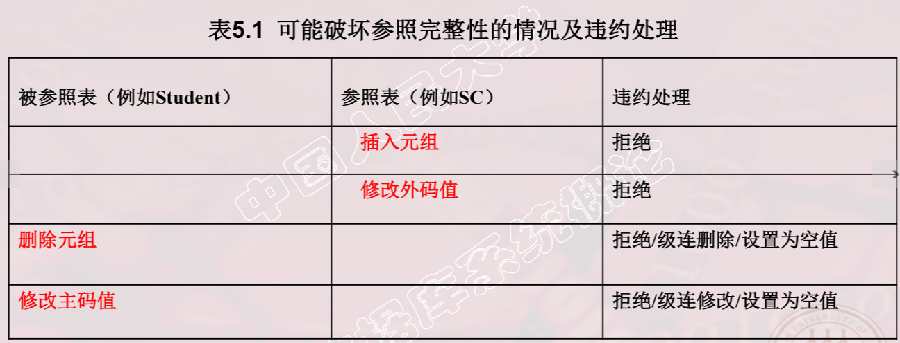

# 零、数据库完整性

> - 数据库的完整性 
>   - 数据的正确性是指数据是符合现实世界语义，反映了当前实际状况的 例如: 
>     - 学生的学号必须唯一 
>     - 性别只能是男或女 
>     - 成绩的取值范围为0~100 
>   - 数据的相容性是指数据库同一对象在不同关系表中的数据是符合逻辑的 例如: 
>     - 学生所选的课程必须是学校开设的课程 
>     - 学生所在的院系必须是学校已成立的院系 
> - 数据的完整性和安全性是两个不同概念 
>   - 数据的完整性 
>     - 防止数据库中存在不符合语义的数据，也就是防止数据 库中存在不正确的数据 
>     - 防范对象：不合语义的、不正确的数据 
>   - 数据的安全性 
>     - 保护数据库 防止恶意的破坏和非法的存取 
>     - 防范对象：非法用户和非法操作 
>   - 完整性是阻止合法用户通过合法操作向数据库中加入不正确的数据 
>   - 安全性防范的是非法用户和非法操作 存取数据库中的正确数据 
> - 为维护数据库的完整性，数据库管理系统必须： 
>   1. 提供定义完整性约束条件的机制 
>      - 完整性约束条件也称为完整性规则，是数据库中的数据必须满足的语义约束条件 
>      - SQL标准使用了一系列概念来描述完整性，包括关系模 型的实体完整性、参照完整性和用户定义完整性
>      - 这些完整性一般由SQL的数据定义语言语句来实现   
>   2. 提供完整性检查机制 
>      1. 数据库管理系统中检查数据是否满足完整性约束条件的机制 称为完整性检查。 
>      2. 一般在INSERT、UPDATE、DELETE语句执行后开始检查， 也可以在事务提交时检查  
>   3.  违约处理  
>      - 数据库管理系统若发现用户的操作违背了完整性约束条件， 就采取一定的动作 
>        - 拒绝（NO ACTION）执行该操作 
>        - 级连（CASCADE）执行其他操作 
> - 由DBMS进行完整性检查的好处
>   - 不必由应用程序来完成，从而减轻了应用程序员的负担。 
>   - 能够为所有的用户和所有的应用提供一致的数据库完 整性，避免出现漏洞。 

# 一、实体完整性

> -  关系模型的实体完整性 
>   - CREATE  TABLE中用PRIMARY KEY定义 
>
> - 单属性构成的码有两种说明方法  
>   - 定义为列级约束条件 
>   - 定义为表级约束条件 
> - 对多个属性构成的码只有一种说明方法 
>   - 定义为表级约束条件  
> - 插入或对主码列进行更新操作时，关系数据库管理系统按 照实体完整性规则自动进行检查。 
>   - 检查主码值是否唯一，如果不唯一则拒绝插入或修改 
>   - 检查主码的各个属性是否为空，只要有一个为空就拒 绝插入或修改 
> - 检查记录中主码值是否唯一的一种方法是进行全表扫描 
>   -  依次判断表中每一条记录的主码值与将插入记录上的 主码值（或者修改的新主码值）是否相同  
> - 表扫描缺点 
>   - 十分耗时 
>   - 为避免对基本表进行全表扫描，RDBMS核心一 般都在主码上自动建立一个索引 

# 二、参照完整性

> - 若属性（或属性组）F是基本关系R的外码它与基本关系S的主码Ks相对应（基本关系R和S不一定是不同的关系），则 对于R中每个元组在F上的值必须为： 
>   - 或者取空值（F的每个属性值均为空值） 
>   - 或者等于S中某个元组的主码值 
>
> ```sql
> Sdept  CHAR(20) FOREIGN KEY REFERENCES DEPT(Deptno)  /*在列级定义参照完整性*/ 
> FOREIGN KEY(Sdept) REFERENCES DEPT(Deptno)     /*在表级定义参照完整性*/ 
> ```
>
> - 一个参照完整性将两个表中的相应元组联系起来 
>
> - 对被参照表和参照表进行增删改操作时有可能破坏参照完整性，必须进行检查 
>
> - DBMS什么时候要进行参照完整性的检查
>
> - 参照完整性违约处理
>
>   - 拒绝（NO ACTION）执行 
>     - 不允许该操作执行。该策略一般设置为默认策略 
>   - 级联（CASCADE）操作
>     - 当删除或修改被参照表（Student）的一个元组造成了与参照 表（SC）的不一致，则删除或修改参照表中的所有造成不一 致的元组 
>   - 设置为空值（SET-NULL） 
>     - 当删除或修改被参照表的一个元组时造成了不一致，则将参照 表中的所有造成不一致的元组的对应属性设置为空值。
>
>   ```sql
>    CREATE TABLE SC         
>    (  Sno   CHAR(9)  NOT NULL，            
>     Cno   CHAR(4)  NOT NULL，            
>     Grade  SMALLINT,            P
>     RIMARY KEY(Sno,Cno)，                
>     FOREIGN KEY (Sno) REFERENCES Student(Sno)    
>     ON DELETE CASCADE        /*级联删除SC表中相应的元组*/               
>     ON UPDATE CASCADE,      /*级联更新SC表中相应的元组*/            
>     FOREIGN KEY (Cno) REFERENCES Course(Cno)                                   
>     ON DELETE NO ACTION      /*当删除course 表中的元组造成了与SC表不一致时拒绝删除*/    
>     ON UPDATE CASCADE             /*当更新course表中的cno时，级联更新SC表中相应的元组*/     	); 
>   ```

# 三、用户自定义的完整性

> -  用户定义的完整性是：针对某一具体应用的数据必须满足的语义要求 
> -  关系数据库管理系统提供了定义和检验用户定义完整性的机制，不必由应用程序承担 
> - CREATE TABLE时定义属性上的约束条件 
>   - 列值非空（NOT NULL） 
>   - 列值唯一（UNIQUE） 
>   - 检查列值是否满足一个条件表达式（CHECK） 
>     -  Ssex  CHAR(2)  CHECK （Ssex IN （‘男’,’女’））
> - 属性上的约束条件检查和违约处理 
>   -  插入元组或修改属性的值时，关系数据库管理系统检 查属性上的约束条件是否被满足 
>   -  如果不满足则操作被拒绝执行  
> - 元组级的限制：可以设置不同属性之间的取值的相互约束条件  
>   -    CHECK (Ssex='女' OR Sname NOT LIKE 'Ms.%') 
>   - 元组上的约束条件检查和违约处理 
>     -  插入元组或修改属性的值时，关系数据库管理系统检 查元组上的约束条件是否被满足 
>     - 如果不满足则操作被拒绝执行  

# 四、完整性约束命名子句

> - .完整性约束命名子句
>
>   - CONSTRAINT <完整性约束条件名><完整性约束条件> 
>   - <完整性约束条件>包括NOT NULL、UNIQUE、 PRIMARY KEY短语、FOREIGN KEY短语、CHECK 短语等 
>
>   ```mysql
>   CREATE TABLE Student       
>   (Sno  NUMERIC(6) CONSTRAINT C1 CHECK (Sno BETWEEN 90000 AND 99999),           	Sname  CHAR(20) CONSTRAINT C2 NOT NULL,           
>   Sage  NUMERIC(3) CONSTRAINT C3 CHECK (Sage < 30),          
>    Ssex  CHAR(2) CONSTRAINT C4 CHECK (Ssex IN ( ‘男’,'女')),           
>    CONSTRAINT StudentKey PRIMARY KEY(Sno)         
>   ); 
>   ```
>
> - 修改表中的完整性限制 
>
>   - 使用ALTER TABLE语句修改表中的完整性限制 
>   -  ALTER TABLE Student          DROP CONSTRAINT C4; 
>   - ALTER TABLE Student ADD CONSTRAINT C1 CHECK (Sno BETWEEN 900000                                                                        AND 999999)
>   - 先删再增

# 五、域中完整性限制

# 六、断言

> - SQL中，可以使用 CREATE ASSERTION语句，通过声 明性断言来指定更具一般性的约束。 
>   - 可以定义涉及多个表的或聚集操作的比较复杂的完整性约束。 
>   - 断言创建以后，任何对断言中所涉及的关系的操作都会触 发关系数据库管理系统对断言的检查，任何使断言不为真 值的操作都会被拒绝执行 
> - 创建断言的语句格式       
>   -  CREATE ASSERTION<断言名><CHECK 子句>  
>   - 每个断言都被赋予一个名字 
>   - <CHECK 子句>中的约束条件与WHERE子句的条件表达 式类似。
> -  删除断言的语句格式为 
>   - DROP ASSERTION <断言名>; 

# 七、触发器

> - 触发器（Trigger） 
>
>   - 是用户定义在关系表上的一类由事件驱动的特殊过程 
>   - 任何用户对表的增、删、改操作均由服务器自动激活 相应的触发器 
>   - 触发器可以实施更为复杂的检查和操作，具有更精细 和更强大的数据控制能力  
>
> - 定义触发器
>
>   ```sql
>   CREATE TRIGGER <触发器名>          
>   {BEFORE | AFTER} <触发事件> 
>   ON <表名>        
>   REFERENCING NEW|OLD ROW AS <变量>        
>   FOR EACH  {ROW | STATEMENT}        
>   [WHEN <触发条件>]<触发动作体> 
>   ```
>
>   -  表的拥有者才可以在 表上创建触发器 
>
>   - 触发器可以包含模式名，也可以不包含模式名
>
>   - 同一模式下，触发器名字必须是唯一的
>
>   - 触发事件可以是Insert /delete/update极其组合
>
>   -  AFTER表示在触发事件的操作执行之后激活触发器 
>
>   - BEFORE表示在触发事件的操作执行之前激活触发器 
>
>   - 触发器只能定义在基本表上，不能定义 在视图上 
>
>   - 当基本表的数据发生变化时，将激活定 义在该表上相应触发事件的触发器 
>
>   -  REFERENCING NEW|OLD ROW AS <变量>  定义新变量
>
>   -  触发器类型 
>
>     - 行级触发器（FOR EACH ROW） 
>
>       语句级触发器（FOR EACH STATEMENT） 
>
>   - 触发器被激活时，只有当触发条件为真时触发动 作体才执行;否则触发动作体不执行。 •如果省略WHEN触发条件，则触发动作体在触发 器激活后立即执行 
>
>   -  触发动作体可以是一个匿名PL/SQL 过程块，也可以是对已创建存储过程的调用 
>
>   - 如果是行级触发器，用户都可以在 过程体中使用NEW和OLD引用事件 之后的新值和事件之前的旧值 
>
>   - 如果是语句级触发器，则不能在触 发动作体中使用NEW或OLD进行引用 
>
>   - 如果触发动作体执行失败，激活触 发器的事件就会终止执行，触发器 的目标表或触发器可能影响的其他 对象不发生任何变化  
>
>   - 当特定的系统事件发生时，对规则的条件进行检查，如果条件成立则 执行规则中的动作，否则不执行该动作。规则中的动作体可以很复杂， 通常是一段SQL存储过程。
>
>   -   触发器又叫做事件-条件-动作（event-condition-action）规则
>
> - 激活触发器
>
>   - 触发器的执行，是由触发事件激活的，并由数据库服务器 自动执行 
>   - 一个数据表上可能定义了多个触发器，遵循如下的执行顺 序: 
>     1. 执行该表上的BEFORE触发器; 
>     2. 激活触发器的SQL语句; 
>     3. 执行该表上的AFTER触发器。 
>
> - 删除触发器
>
>   - DROP TRIGGER <触发器名> ON <表名>; 
>   -  触发器必须是一个已经创建的触发器，并且只能由具有相应权限的用户删除。 

# 八、小结