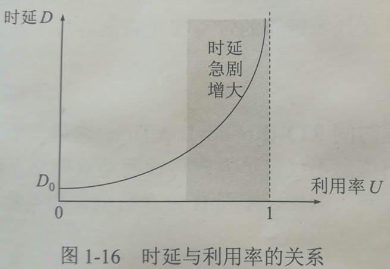

## 一、计算机网络的性能指标

### 1.1 速率

> - 数据的传送速率
> - 数据率和比特率
> - 单位：bit/s,kb/s,Mb/s,Gb/s,Tb/s

### 1.2 带宽

> - 通信线路允许通过的信号的频带范围
> - 单位：Hz
> - 频域称谓
> - 一定程度上可表示通信线路所能传输的“最高比特率”

> - 通信线路所能传输数据的能力
> - 在单位时间内网络中的某信道所能通过的最高数据率
> - 单位：bit/s,kb/s,Mb/s,Gb/s,Tb/s
> - 时域称谓

### 1.3 吞吐量

> - throughput
> - 单位时间内通过某个网络（或信道、接口）的实际数据量

### 1.4 时延

> 总时延=发送时延+传播时延+处理时延+排队时延

#### 1.4.1 发送时延（传输时延）

> - 主机或路由器发送数据帧所需要的时间
> - 发送时延=数据帧长度/发送速率

#### 1.4.2 传播时延

> - 电磁波在信道中传播一定的距离需要花费的时间
> - 传播时延=信道长度/电磁波在信道上的传播速率

#### 1.4.3 处理时延

> - 主机或者路由器在收到分组时要花费一定的时间进行处理
> - 例如分析首部，提取数据部分，差错检验，寻找合适的路由转发

#### 1.4.4 排队时延

> - 输入队列等待处理
> - 输出队列等待发送
> - 网络通信量大的时候，排队时延长，如果队列溢出，则丢弃分组，这时排队时延为无穷大

### 1.5 时延带宽积

> - 发送端连续发送数据，第一比特即将到达终点时，发送端已经发送的数据
> - 时延带宽积=传播时延*带宽

### 1.6 往返时间RTT

> - 发送端开始发送数据，到接收到接收端的确认（接收端接收到数据立即发送确认），总共经历的时延
> - 包括处理时延，排队时延，传播时延和确认帧的发送时延

### 1.7 利用率

> - 信道利用率：信道使用时间占总时间的比值
> - 网络利用率：信道利用率的加权平均
> - 利用率上升会引起时延增加，当利用率超过50%时，应该考虑扩容
> - D=D/（1-U）

## 二、计算机网络的非性能指标

### 2.1 费用

> - 必须要考虑的，包括设计费用和实现费用
> - 网络的速率越高，其价格也越高

### 2.2 质量

> - 网络的质量取决于网络中所有构建的质量，以及这些构建是怎样组成网络的
> - 影响网络的可靠性，网络管理的简易性、网络性能
> - 质量好的网络，价格比较高

### 2.3 标准化

> - 网络的硬件设计和软件设计既可以采用通用的国际标准，也可遵循特定的专用网标准。
> - 采用国际标准有较高的可互操作性，易于维护和升级，也更易于得到技术上的支持

### 2.4 可靠性

> - 与网络的质量和性能有密切的关系
> - 通常高速网络要可靠的运行，其维护的费用较高

### 2.5 可扩展性和可升级性

> - 可扩展性： 网络规模扩大
> - 可升级性： 性能和版本的提高
> - 性能越高，其扩展费和难度也越高

### 2.6 易于管理和维护

> - 只有易于管理和维护的网络才能达到和保持设计的性能