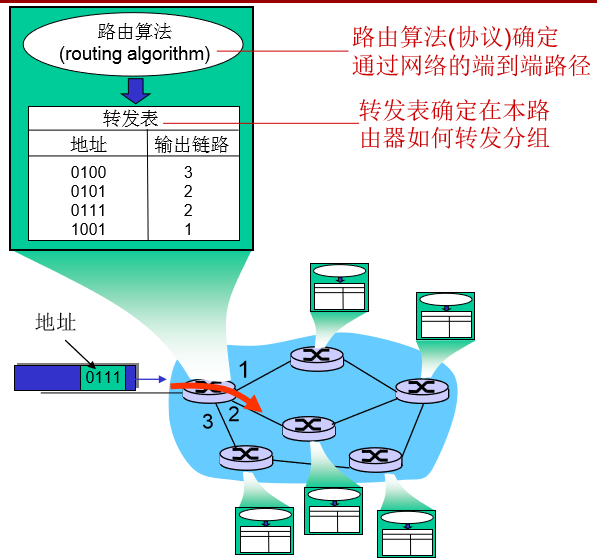

# 一、网络层的功能

> - 接收发送主机的数据段（segment),并封装到数据报中（datagram）
>   - 上层为传输层
>   - 发送主机网络层的功能
> - 将数据报（datagram）解析为数据段（segment）,并向上层交付
>   - 接收主机网络层的功能
>   - 上层为传输层
> - 路由器检验所有穿越它的IP数据报的头部域
>   - 决策如何处理IP数据报
> - 转发(forwarding): 将分组从路由器的输入端口转移到合适的输出端口 
>   - 核心功能
> - 路由(routing): 确定分组从源到目的经 过的路径 
>   - 核心功能
>   - 路由算法 （routing algorithms） 
> - 数据分组传输之前两端主机需要首先建立虚拟/逻辑连接
>   - 核心功能
>   -  网络设备（如路由器）参与连接的建立 

**网络层连接和传输层连接的区别**

>  网络层连接: 两个主机之间 (路 径上的路由器等网络设备参与 其中) 
>
> 传输层连接: 两个应用进程之 间（对中间网络设备透明） 

## 二、网络层服务模型

> - 无连接服务(connection-less service):  
> - 不事先为系列分组的传输确定传输路径
> - 每个分组独立确定传输路径  不同分组可能传输路径不同
> - 数据报网络(datagram network )
> - 连接服务(connection service):  
>   - 首先为系列分组的传输确定从源到目的经过的路径 (建立连接) 
>   -  然后沿该路径（连接）传输系列分组 
>   - 系列分组传输路径相同 
>   - 传输结束后拆除连接 
>   - 虚电路网络(virtual-circuit network ) 